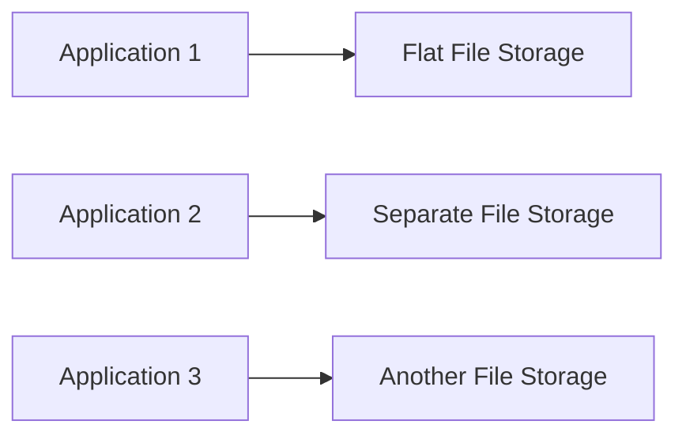
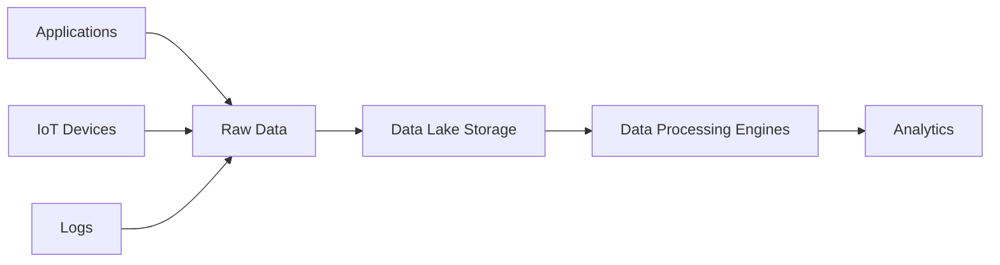
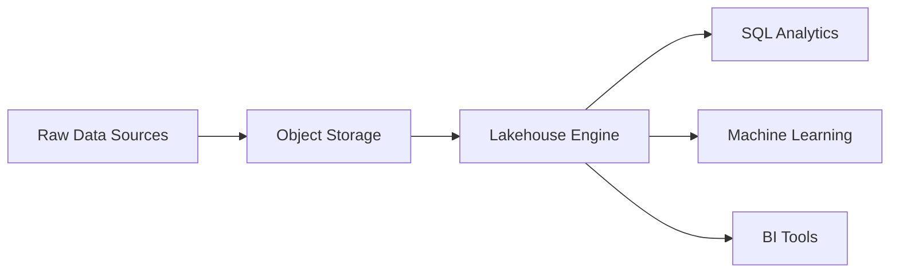
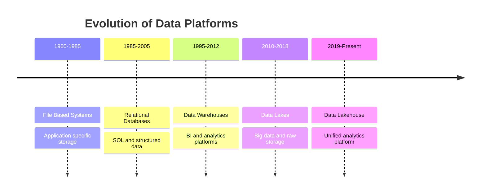
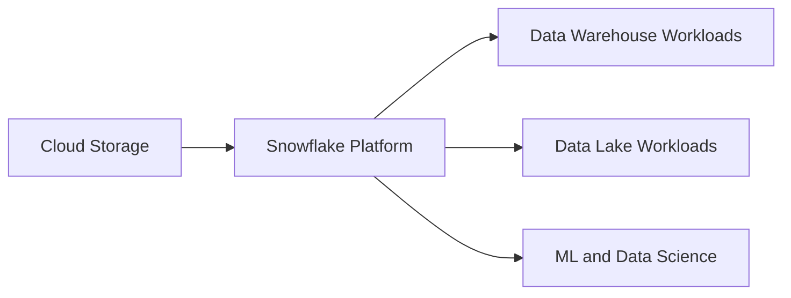

## 01 — Foundations

### Evolution of Data and Analytics Architecture

---

## 1. Early Data Era — File-Based Systems (1960–1985)

Organizations stored data directly in application files. Every application managed its own data.

Problems:

* Data duplication
* No centralized analytics
* Hard to scale
* Data tightly coupled with applications

Typical storage:

* Flat files
* Mainframe storage
* CSV / text files

Result:
Data silos everywhere.

---

## 2. Relational Database Era (1985–2005)

Introduction of relational databases.

Major shift:
Structured storage with SQL.

Key technologies:

* OLTP databases
* Relational schema
* ACID transactions

Examples:

* Oracle Database
* IBM DB2
* MySQL

Characteristics:

* Structured data
* Normalized schema
* Optimized for transactions

Problem:
Analytics queries slowed down transactional systems.

---

# 3. Data Warehouse Era (1995–2012)

Organizations separated analytics from transactional systems.

Concept:
Central analytical repository.

Definition:
A **Data Warehouse** stores structured historical data optimized for reporting and analytics.

Key characteristics:

* Structured schema
* Historical data
* Batch ETL pipelines
* Star / Snowflake schema

Typical pipeline:

Common tools:

* Teradata
* Amazon Redshift
* Snowflake

Advantages:

* Fast analytics
* Structured governance
* Business intelligence reporting

Limitations:

* Only structured data
* Expensive storage
* Rigid schema

---

# 4. Big Data Era — Data Lake (2010–Present)

Explosion of data sources.

New data types:

* Logs
* IoT
* Images
* Video
* JSON
* Streaming data

Traditional warehouses could not scale.

Solution:
**Data Lake**

Definition:
A **Data Lake** stores raw data of any format in large-scale distributed storage.

Typical storage:

* Object storage
* Distributed file systems

Examples:

* Amazon S3
* Hadoop Distributed File System

Architecture:

Advantages:

* Cheap storage
* Store any format
* Massive scalability

Problems:

* No schema control
* Poor governance
* Data swamp risk

---

# 5. Modern Architecture — Data Lakehouse (2019–Present)

Industry combined advantages of **data warehouse + data lake**.

Concept:
Single platform supporting:

* Data lake storage
* Data warehouse performance
* SQL analytics
* Machine learning

Definition:
A **Data Lakehouse** is a unified data architecture that combines low-cost data lake storage with warehouse-style analytics capabilities.

Examples:

* Snowflake
* Databricks Lakehouse Platform

Architecture:

Benefits:

* Unified platform
* Structured + unstructured data
* High performance
* Reduced duplication

---

# 6. Timeline of Data Architecture Evolution

---

# 7. Architecture Comparison

| Architecture   | Data Type  | Storage Cost | Query Performance   | Use Case          |
| -------------- | ---------- | ------------ | ------------------- | ----------------- |
| File Systems   | Structured | Medium       | Poor                | Legacy systems    |
| Relational DB  | Structured | High         | High (transactions) | OLTP              |
| Data Warehouse | Structured | High         | High (analytics)    | BI reporting      |
| Data Lake      | Any format | Low          | Medium              | Big data storage  |
| Lakehouse      | Any format | Medium       | Very High           | Unified analytics |

---

# 8. Where Snowflake Fits

Snowflake represents a **modern cloud lakehouse-style platform**.

Core idea:

Key principle:

Separation of:

* Storage
* Compute
* Cloud services

This architecture is the foundation of modern Snowflake systems.
