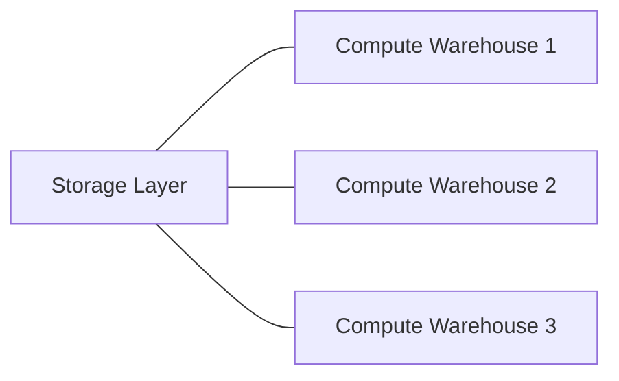
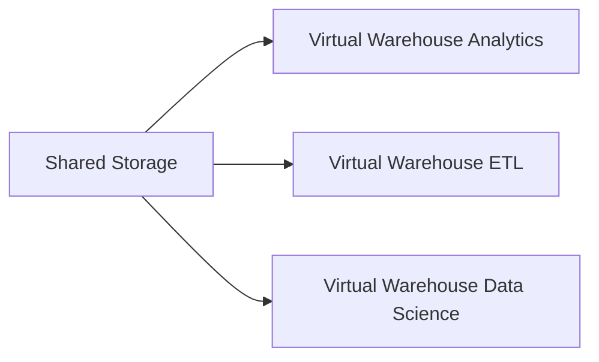
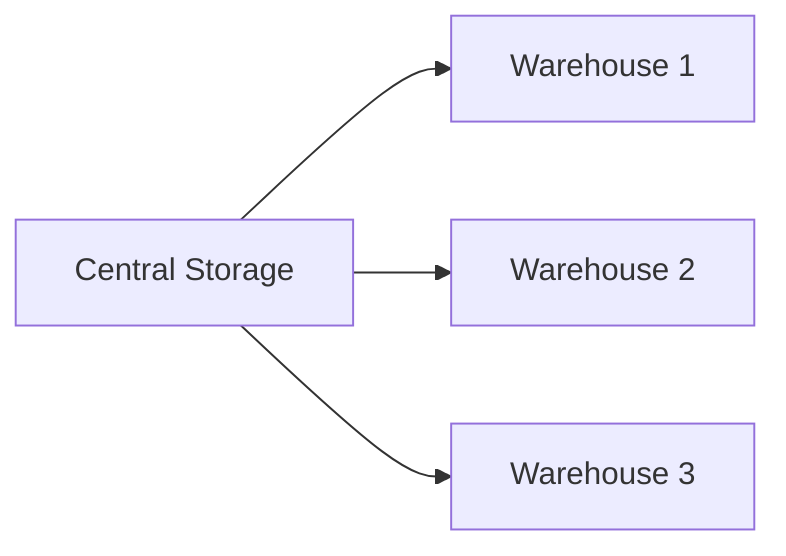

# Snowflake Architecture Overview

Snowflake is a cloud-native data platform built specifically for modern analytics workloads. Unlike traditional data warehouses that tightly couple storage and compute resources, Snowflake separates these components into independent layers. This design allows organizations to scale storage and compute independently while maintaining high concurrency and performance.

Snowflake architecture is built on three primary layers:

1. Storage Layer
2. Compute Layer (Virtual Warehouses)
3. Cloud Services Layer

This layered model enables high scalability, elastic performance, and simplified data management.

---

# High Level Architecture

Explanation:

Users interact with Snowflake using SQL clients, BI tools, APIs, or applications.
The cloud services layer manages authentication, metadata, and query planning.
Virtual warehouses execute the queries.
All data resides in scalable cloud object storage.

---

# Core Architecture Principle

Snowflake is based on **Separation of Storage and Compute**.

Traditional warehouses combine compute and storage in a single system. When compute increases, storage must also increase even if unnecessary.

Snowflake removes this dependency.

Multiple compute clusters can access the same data without interfering with each other.

Benefits:

* Independent scaling
* High concurrency
* Cost optimization
* No resource contention

---

# Storage Layer

The storage layer is responsible for persistent data storage. Snowflake automatically manages the storage of data in optimized columnar format.

Key characteristics:

* Data stored in compressed columnar format
* Automatic micro-partitioning
* Data encryption
* Automatic replication and fault tolerance

Snowflake stores data internally in cloud object storage provided by:

* Amazon Web Services
* Microsoft Azure
* Google Cloud Platform

Users never manage files directly; Snowflake handles storage automatically.

---

# Compute Layer (Virtual Warehouses)

The compute layer performs query processing.

Snowflake uses **Virtual Warehouses**, which are independent compute clusters used to execute SQL queries and data processing tasks.

Characteristics:

* Independent compute clusters
* Each warehouse has dedicated CPU and memory
* Warehouses can run in parallel
* Auto scaling supported

Example architecture:

Each workload runs on its own compute cluster without affecting others.

---

# Cloud Services Layer

The cloud services layer is the brain of Snowflake. It manages all coordination activities across the platform.

Responsibilities include:

* Authentication and security
* Metadata management
* Query parsing and optimization
* Access control
* Infrastructure coordination
* Transaction management

This layer ensures queries are routed to the correct compute warehouse and executed efficiently.

---

# Shared Data Architecture

Snowflake uses a **shared data architecture** where multiple compute clusters access a centralized storage layer.

This architecture eliminates data duplication and allows many users to run queries simultaneously.

Advantages:

* No data copies required
* High concurrency
* Simplified data management

---

# Comparison with Traditional Data Warehouse

| Feature             | Traditional Warehouse | Snowflake     |
| ------------------- | --------------------- | ------------- |
| Storage and Compute | Coupled               | Separated     |
| Scalability         | Limited               | Elastic       |
| Infrastructure      | User managed          | Fully managed |
| Concurrency         | Limited               | High          |
| Data sharing        | Complex               | Built-in      |

---

# Snowflake Query Flow (Simplified)

Process:

1. User submits SQL query
2. Cloud services validate and optimize the query
3. Query is sent to the selected virtual warehouse
4. Warehouse reads data from storage
5. Results returned to the user

---

# Key Architectural Advantages

Snowflake architecture provides several major advantages:

Elastic scalability
Independent workload isolation
High concurrency support
Automatic infrastructure management
Secure centralized data storage

This architecture enables Snowflake to function as both a modern **cloud data warehouse** and a **lakehouse analytics platform**.
