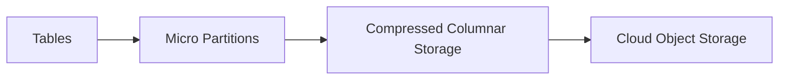
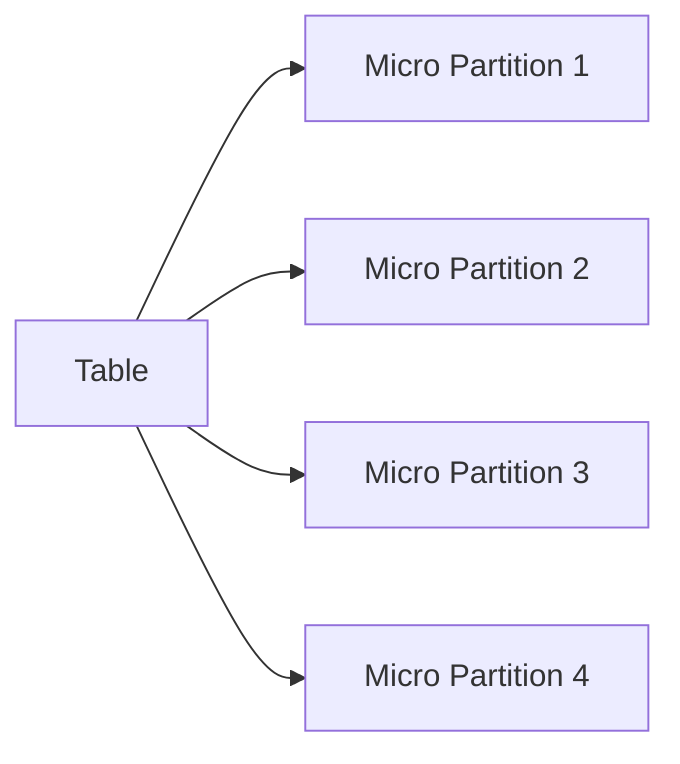
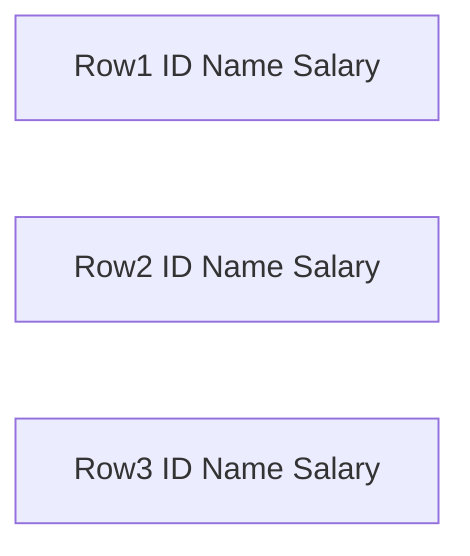
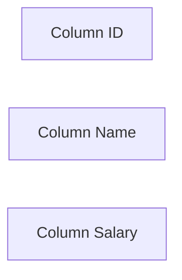
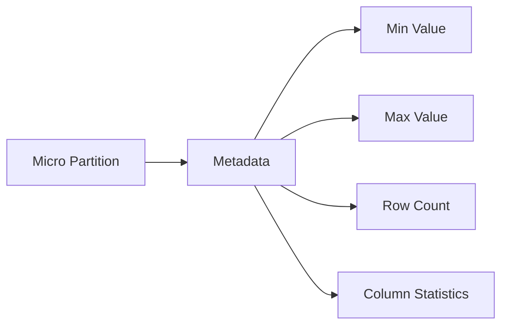
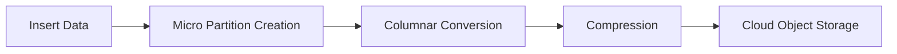

# Snowflake Storage Layer

The **storage layer** in Snowflake is responsible for storing and organizing all persistent data. Snowflake automatically manages the storage infrastructure and optimizes how data is stored and retrieved.

Users do not manage disks, files, or storage formats. Snowflake abstracts these details and provides a structured interface through SQL.

The storage layer is built on scalable object storage provided by major cloud providers.

Examples:

* Amazon Web Services
* Microsoft Azure
* Google Cloud Platform

---

# Storage Architecture

All data stored in Snowflake is automatically converted into an optimized internal format. Data is stored in compressed columnar format and divided into small units called **micro-partitions**.



Process:

1. Data is inserted into a table
2. Snowflake automatically splits it into micro-partitions
3. Data is compressed and stored in columnar format
4. Stored inside cloud object storage

---

# Micro-Partitions

Snowflake divides table data into **micro-partitions**. Each micro-partition contains a small subset of table rows.

Typical characteristics:

* Size: 50 MB to 500 MB uncompressed
* Stored in columnar format
* Immutable once written



Each micro-partition contains:

* Column data
* Metadata
* Statistics for query optimization

Because partitions are immutable, updates create new partitions rather than modifying existing ones.

Advantages:

* Efficient query pruning
* Parallel processing
* Faster scans

---

# Columnar Storage Format

Snowflake stores data using **columnar storage**, meaning values from the same column are stored together.

Traditional row format:



Columnar format:



Benefits:

* Faster analytical queries
* Efficient compression
* Reduced disk usage

Columnar storage is optimized for read-heavy workloads such as analytics.

---

# Automatic Compression

Snowflake automatically compresses stored data.

Compression methods include:

* Dictionary encoding
* Run-length encoding
* Delta encoding

Snowflake chooses the best compression algorithm automatically.

Advantages:

* Reduced storage cost
* Faster data scans
* Improved query performance

---

# Metadata Storage

Snowflake maintains detailed metadata about each micro-partition.

Metadata includes:

* Minimum and maximum values
* Column statistics
* Number of rows
* Data distribution



Query optimizer uses metadata to avoid scanning unnecessary partitions.

This process is called **partition pruning**.

Example:

If a query filters `WHERE order_date = '2025-01-01'`, Snowflake only scans partitions containing that date.

---

# Immutable Storage Design

Snowflake uses **immutable storage**.

Once a micro-partition is written, it cannot be modified.

Updates work as follows:


Advantages:

* Safe concurrent reads
* Supports time travel
* Enables cloning

---

# Time Travel

Time Travel allows access to historical versions of data.

Users can query data from the past.

Example:

```sql
SELECT * FROM orders AT (TIMESTAMP => '2025-01-01 10:00:00');
```

Capabilities:

* Recover deleted data
* Query historical data
* Restore tables

Retention period depends on edition and configuration.

---

# Fail-safe

Fail-safe provides an additional recovery mechanism after Time Travel expires.

Characteristics:

* Managed entirely by Snowflake
* Not user-accessible directly
* Used for disaster recovery

Typical duration:

* 7 days after Time Travel

---

# Storage Encryption

Snowflake automatically encrypts all stored data.

Encryption applies to:

* Data at rest
* Data in transit

Encryption uses strong cryptographic standards.


Users do not manage encryption keys unless using advanced configurations.

---

# Storage Layer Responsibilities

The storage layer handles several critical tasks:

Data persistence
Micro-partition management
Compression
Encryption
Metadata tracking
Historical versioning

All of these are managed automatically by Snowflake.

---

# Storage Workflow



This architecture enables Snowflake to scale storage independently from compute while maintaining high query performance.
