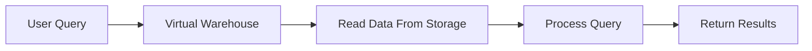
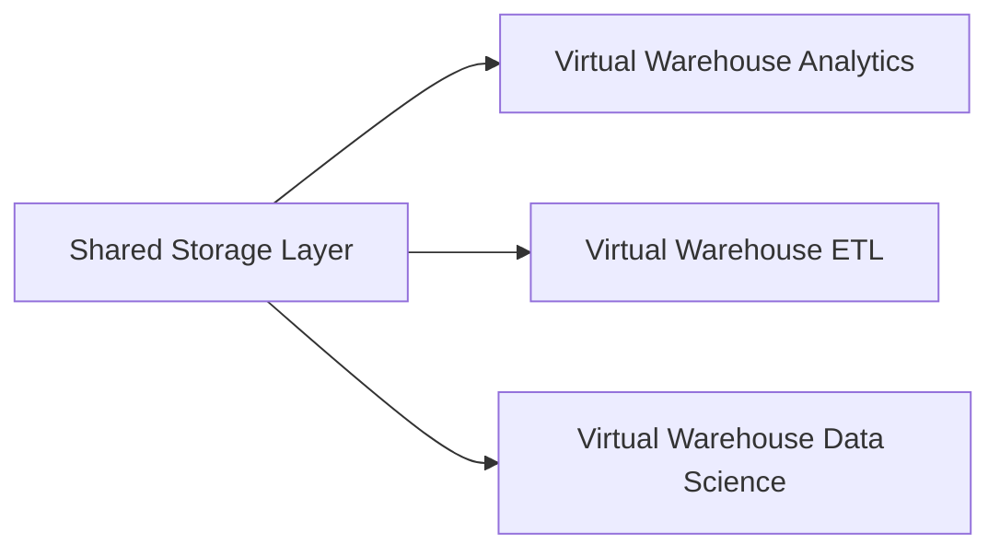
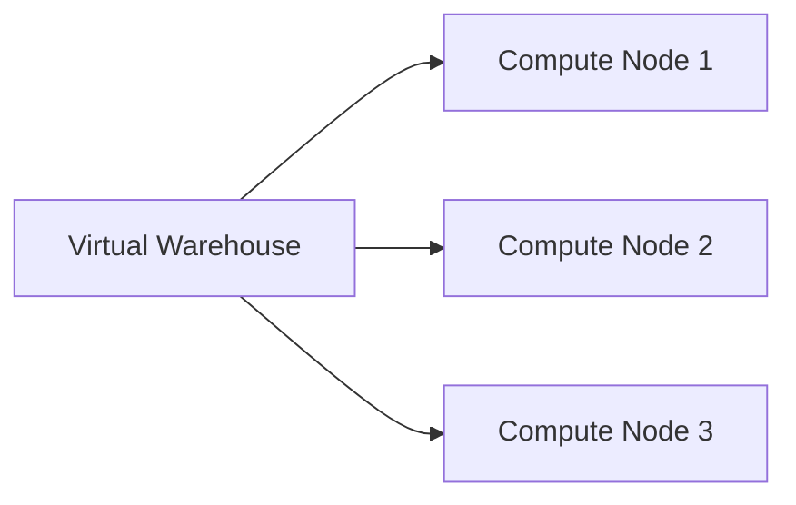
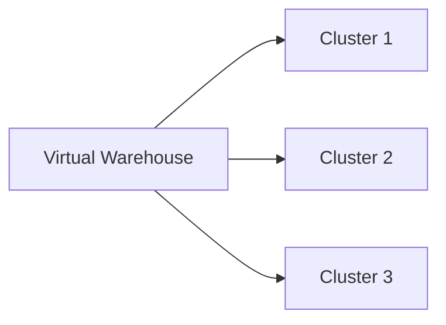
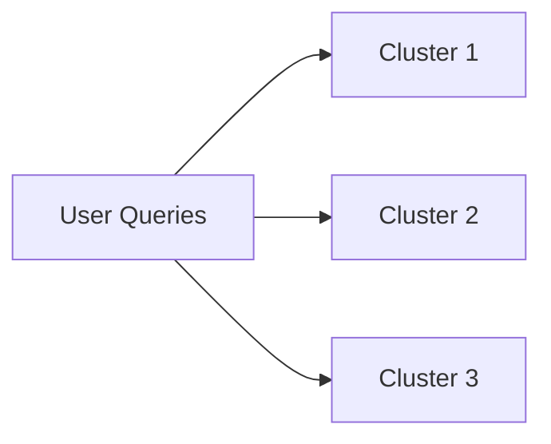
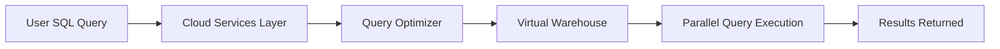
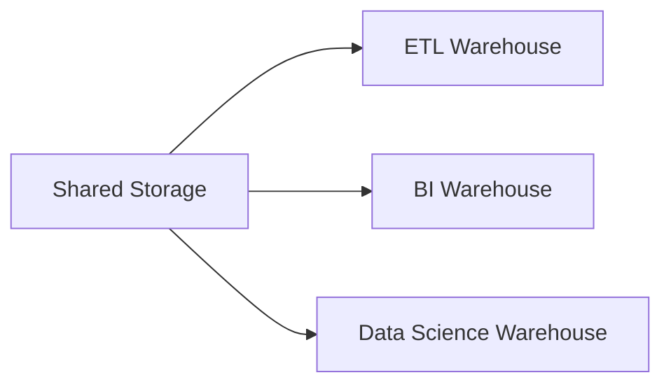
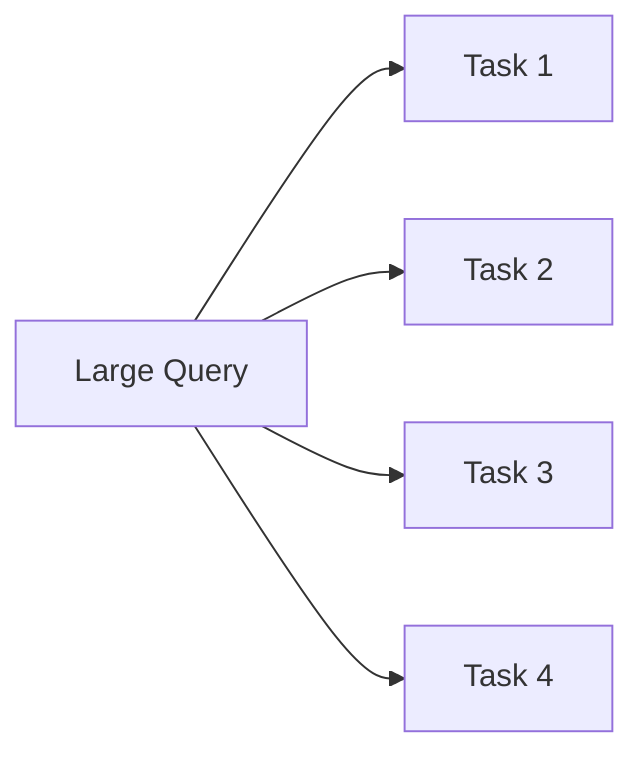

# Compute Layer — Virtual Warehouses

The **compute layer** in Snowflake is responsible for executing queries and performing all data processing operations. Unlike traditional data warehouses, Snowflake separates compute from storage. Compute resources are provided through **Virtual Warehouses**.

A **Virtual Warehouse** is a cluster of compute resources (CPU, memory, and temporary storage) used to process SQL queries, data loading, and transformations.

---

# Role of the Compute Layer

The compute layer performs the following operations:

* SQL query execution
* Data transformation
* Data loading operations
* Aggregations and joins
* Query parallelization

The compute layer reads data from the storage layer but does not store data permanently.

---

# Virtual Warehouse Architecture

Each virtual warehouse is an independent compute cluster. Multiple warehouses can operate simultaneously while accessing the same underlying data.

Key principle:

All warehouses share the same data but operate with separate compute resources.

This prevents query contention between workloads.

---

# Warehouse Components

A virtual warehouse internally consists of multiple compute nodes.

Each node contains:

* CPU resources
* Memory
* Local temporary disk for query processing

Queries are distributed across nodes for parallel processing.

---

# Warehouse Sizes

Snowflake provides multiple warehouse sizes to control compute capacity.

Typical sizes:

| Warehouse Size | Relative Compute Power |
| -------------- | ---------------------- |
| X-Small        | 1x                     |
| Small          | 2x                     |
| Medium         | 4x                     |
| Large          | 8x                     |
| X-Large        | 16x                    |

Increasing the warehouse size increases compute resources available for queries.

Scaling compute is done without affecting stored data.

---

# Warehouse Scaling

Snowflake supports two types of scaling:

1. **Vertical Scaling**
2. **Horizontal Scaling**

## Vertical Scaling

Increasing the warehouse size increases compute capacity.

Example:

This adds more CPU and memory to the warehouse.

---

## Horizontal Scaling (Multi-Cluster)

Snowflake allows multiple clusters to run under a single warehouse for handling concurrent queries.

This improves query concurrency when many users run queries simultaneously.

---

# Multi-Cluster Warehouse

A **multi-cluster warehouse** automatically starts additional clusters when query load increases.

Benefits:

* High concurrency support
* Automatic load balancing
* Reduced query queueing

---

# Auto Suspend and Auto Resume

Virtual warehouses support automatic lifecycle management.

**Auto Suspend**

Warehouse automatically stops when inactive.

**Auto Resume**

Warehouse automatically starts when a new query arrives.

This reduces compute cost.

---

# Query Execution Workflow

When a query is submitted, the following sequence occurs:

Steps:

1. User submits SQL query
2. Cloud services layer parses and optimizes the query
3. Query is sent to a virtual warehouse
4. Warehouse processes the query in parallel
5. Results are returned to the user

---

# Workload Isolation

Different workloads can run on separate warehouses.

Example architecture:

Advantages:

* No resource contention
* Independent scaling
* Predictable performance

---

# Query Parallelism

Snowflake distributes query tasks across compute nodes.

Each task processes different micro-partitions simultaneously.

This enables high-performance analytics on large datasets.

---

# Compute Layer Responsibilities

The compute layer is responsible for:

Query execution
Parallel processing
Query caching
Workload isolation
Scaling compute resources

All compute resources operate independently from the storage layer, which allows Snowflake to scale workloads efficiently without duplicating data.
