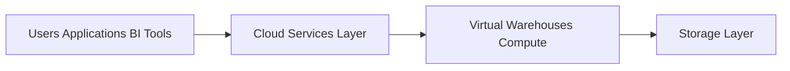
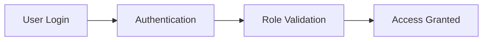
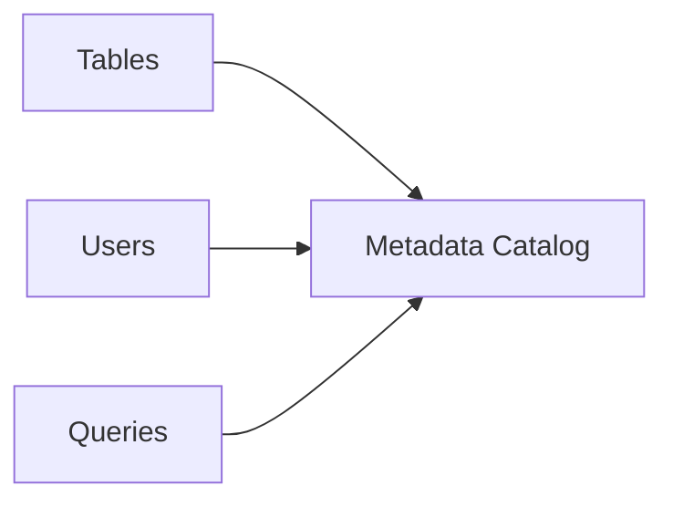
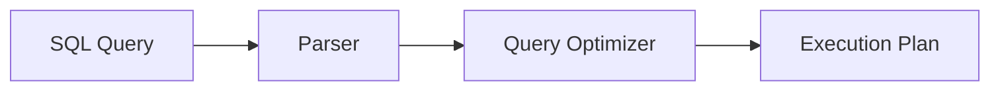
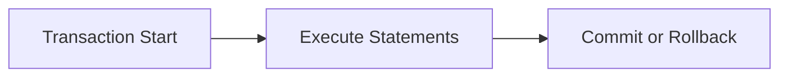
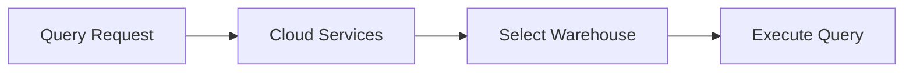
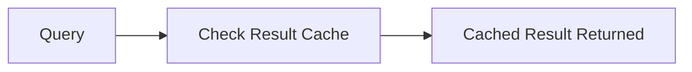
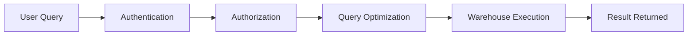

# Cloud Services Layer

The **Cloud Services Layer** is the coordination and control layer of Snowflake.
It manages all system-wide services such as authentication, metadata management, query optimization, transaction control, and infrastructure coordination.

This layer does **not execute queries** and **does not store table data**.
Instead, it manages communication between users, compute resources, and storage.

---

# Position in Snowflake Architecture

Flow:

1. Users submit queries
2. Cloud services layer validates and processes the request
3. Query is sent to a virtual warehouse
4. Warehouse reads data from storage

---

# Core Responsibilities

The cloud services layer provides several critical services.

Primary responsibilities:

* Authentication and access control
* Metadata management
* Query parsing and optimization
* Transaction management
* Infrastructure coordination
* Security policy enforcement

These services allow Snowflake to operate as a fully managed platform.

---

# Authentication and Access Control

The cloud services layer verifies user identity and permissions before any query is executed.

Authentication methods include:

* Username and password
* Key pair authentication
* Single Sign-On
* OAuth authentication

Access control is implemented using **Role-Based Access Control (RBAC)**.

RBAC ensures users can only access data permitted by their assigned roles.

---

# Metadata Management

Metadata describes how data is structured and stored.

Examples of metadata:

* Table definitions
* Schema structures
* Micro-partition statistics
* Query history
* Access privileges

The metadata catalog helps the system locate data efficiently and optimize queries.

---

# Query Parsing and Optimization

When a user submits a SQL query, the cloud services layer analyzes it before execution.

Key steps:

1. SQL parsing
2. Syntax validation
3. Logical query plan creation
4. Query optimization

The optimizer uses metadata statistics to determine the most efficient way to execute the query.

---

# Transaction Management

Snowflake supports **ACID transactions**.

ACID properties:

* Atomicity
* Consistency
* Isolation
* Durability

The cloud services layer ensures that database operations follow these principles.

This guarantees reliable data operations.

---

# Infrastructure Coordination

Snowflake automatically manages system infrastructure.

The cloud services layer coordinates:

* Virtual warehouse management
* Resource allocation
* Query scheduling
* Load balancing

Users do not manage servers or cluster resources.

---

# Query Result Caching

Snowflake stores results of executed queries to improve performance.

When the same query is executed again, Snowflake may return the cached result without re-running the computation.

Benefits:

* Faster query responses
* Reduced compute usage

---

# Security and Governance

The cloud services layer enforces security policies across the platform.

Security features include:

* Role-based access control
* Data masking
* Network policies
* Encryption enforcement

These policies ensure secure data access across the organization.

---

# Query Lifecycle Through Cloud Services

Sequence:

1. User sends SQL query
2. Authentication and authorization are validated
3. Query is parsed and optimized
4. Query is sent to a virtual warehouse
5. Results are returned to the user

---

# Summary of Cloud Services Layer

The cloud services layer acts as the control plane for Snowflake.

Key functions include:

* Authentication and authorization
* Metadata management
* Query planning and optimization
* Transaction management
* Infrastructure orchestration
* Security governance

By centralizing these services, Snowflake provides a fully managed data platform where users focus only on data and queries rather than infrastructure management.
