# Query Processing Lifecycle in Snowflake

The **query processing lifecycle** describes how a SQL query travels through the architecture of Snowflake from submission to result generation.

A query interacts with all three architectural layers:

* Cloud Services Layer
* Compute Layer (Virtual Warehouses)
* Storage Layer

Understanding this lifecycle explains how Snowflake achieves high performance, concurrency, and scalability.

---

# High Level Query Flow

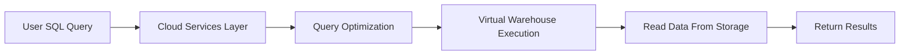

Process overview:

1. User submits SQL query
2. Cloud services validate and optimize the query
3. Virtual warehouse executes the query
4. Data is read from storage
5. Results are returned to the user

---

# Step 1 — Query Submission

Users submit queries through different interfaces.

Examples:

* Web UI
* JDBC / ODBC clients
* BI tools
* APIs
* SQL clients

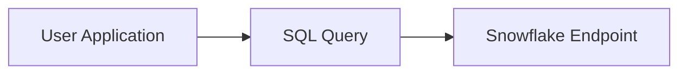

Once the query is submitted, it is sent to the **Cloud Services Layer**.

---

# Step 2 — Authentication and Authorization

The cloud services layer validates the user identity and permissions.

Checks performed:

* User authentication
* Role validation
* Access privileges for objects

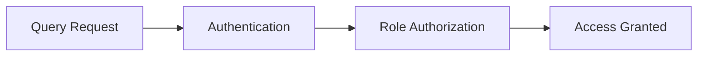

If the user does not have permission, the query is rejected.

---

# Step 3 — Query Parsing

The SQL query is analyzed and converted into an internal representation.

Tasks performed:

* Syntax validation
* SQL parsing
* Logical query plan creation

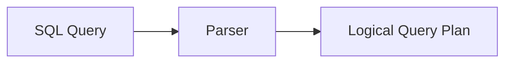

Errors such as incorrect syntax are detected at this stage.

---

# Step 4 — Query Optimization

The query optimizer determines the most efficient way to execute the query.

The optimizer uses metadata such as:

* Micro-partition statistics
* Column distributions
* Table structure
* Data clustering

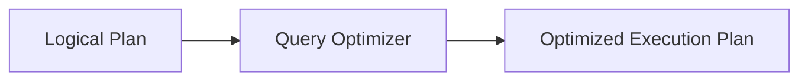

Optimization techniques include:

* Partition pruning
* Join reordering
* Predicate pushdown

This step significantly improves query performance.

---

# Step 5 — Warehouse Selection

After optimization, Snowflake selects the virtual warehouse responsible for executing the query.

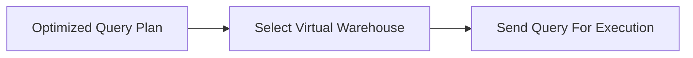

If the warehouse is suspended, it automatically resumes before execution.

---

# Step 6 — Query Execution

The selected **virtual warehouse** processes the query.

Execution tasks include:

* Reading micro-partitions
* Performing joins and aggregations
* Filtering rows
* Parallel data processing

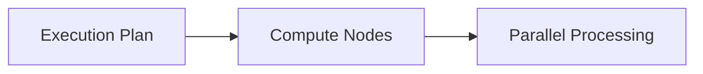

Each node processes a portion of the data simultaneously.

---

# Step 7 — Data Retrieval from Storage

The compute layer reads only required data from the storage layer.

Snowflake uses metadata to avoid scanning unnecessary partitions.

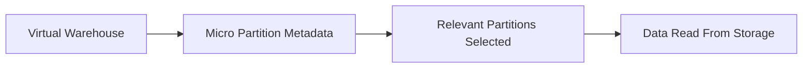

This process is called **partition pruning**.

---

# Step 8 — Query Result Generation

After processing, the results are assembled and returned to the user.

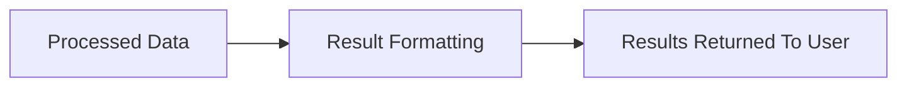

The result is sent back through the cloud services layer.

---

# Result Caching

Snowflake maintains a **result cache**.

If the same query is executed again and the underlying data has not changed, Snowflake returns the cached result.

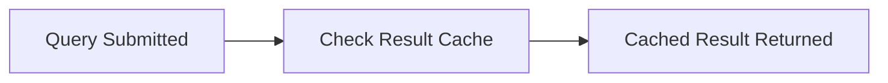

Advantages:

* Faster response time
* Reduced compute usage

---

# Full Query Lifecycle

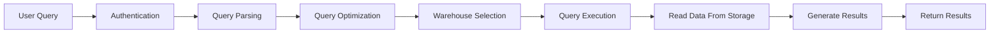

This complete flow ensures queries are validated, optimized, executed efficiently, and returned quickly.

---

# Key Performance Features

Snowflake query processing benefits from several architectural features:

* Automatic query optimization
* Parallel processing
* Partition pruning
* Result caching
* Independent compute scaling

These capabilities allow Snowflake to process very large datasets with high concurrency and performance.
