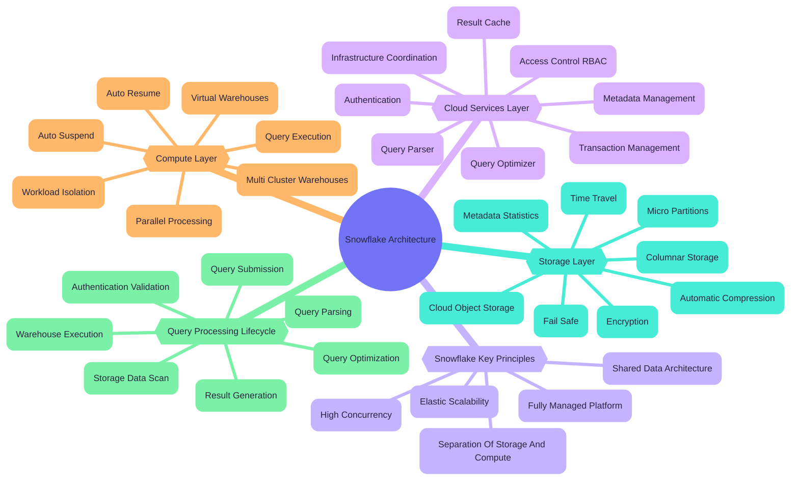

Mindmap overview of the architecture of Snowflake.

```mermaid
---
config:
  theme: redux-color
---
mindmap
((Snowflake Architecture))
  {{Storage Layer}}
    Cloud Object Storage
    Micro Partitions
    Columnar Storage
    Automatic Compression
    Metadata Statistics
    Time Travel
    Fail Safe
    Encryption
  {{Compute Layer}}
    Virtual Warehouses
    Query Execution
    Parallel Processing
    Multi Cluster Warehouses
    Auto Suspend
    Auto Resume
    Workload Isolation
  {{Cloud Services Layer}}
    Authentication
    Access Control RBAC
    Metadata Management
    Query Parser
    Query Optimizer
    Transaction Management
    Infrastructure Coordination
    Result Cache
  {{Query Processing Lifecycle}}
    Query Submission
    Authentication Validation
    Query Parsing
    Query Optimization
    Warehouse Execution
    Storage Data Scan
    Result Generation
  {{Snowflake Key Principles}}
    Separation Of Storage And Compute
    Shared Data Architecture
    Elastic Scalability
    High Concurrency
    Fully Managed Platform
```
