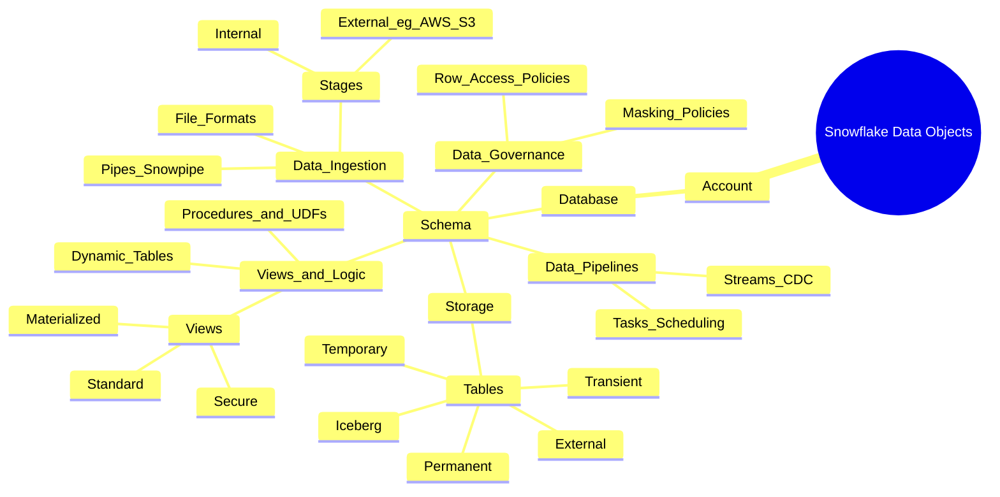

Snowflake data objects form a hierarchical structure used to organize, store, and manage data. The mindmap below shows how different objects relate to each other inside a Snowflake environment. It starts from the Snowflake account and expands into databases, schemas, and the different data objects used for storage, transformation, ingestion, and automation.

