# Data Objects in Snowflake

## Overview

Snowflake organizes data using **logical database objects**. These objects define how data is stored, structured, queried, and managed within the Snowflake platform.

Every workload in Snowflake—analytics, reporting, ETL pipelines, machine learning, or application integrations—interacts with these objects.

Unlike traditional databases, Snowflake separates **compute, storage, and services**, but data itself is still organized using familiar database structures.

At the core of Snowflake’s data organization are **data objects** that exist inside a hierarchical structure.

---

## Snowflake Object Hierarchy

Snowflake objects follow a clear hierarchy. Every object belongs to a schema, schemas belong to databases, and databases belong to a Snowflake account.

This structure allows organizations to separate workloads, teams, and data domains.

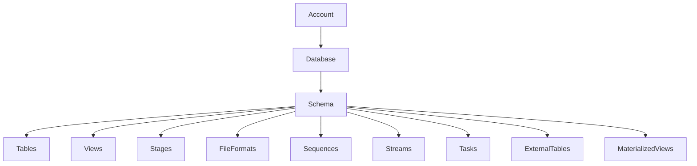

---

## Core Data Objects

The following objects form the foundation of Snowflake data architecture.

### Databases

A **database** is the top-level logical container for data in Snowflake. It holds schemas and provides namespace isolation.

Organizations often create multiple databases to separate environments such as:

* Production
* Development
* Analytics
* Data warehouse domains

Example:

```sql
CREATE DATABASE analytics_db;
```

---

### Schemas

A **schema** is a logical grouping of objects within a database. It helps organize related tables, views, and other objects.

Schemas commonly represent:

* Business domains
* Data pipelines
* Application modules

Example:

```sql
CREATE SCHEMA analytics_db.sales;
```

---

### Tables

Tables are the primary objects used to store structured data.

Snowflake tables store data using **columnar storage with micro-partitions**, which allows high-performance analytical queries.

Tables contain:

* Columns
* Rows
* Metadata
* Micro-partitions

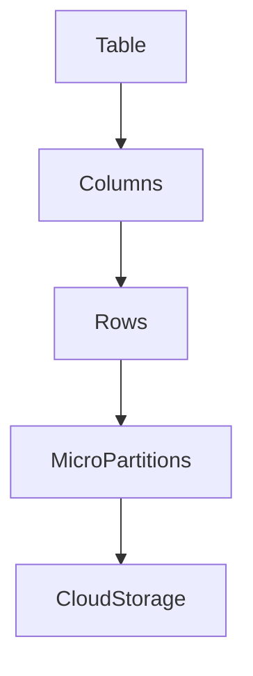

Example:

```sql
CREATE TABLE customers (
    customer_id INTEGER,
    first_name STRING,
    last_name STRING,
    created_at TIMESTAMP
);
```

---

### Views

A **view** is a virtual table created using a SQL query. It does not store data physically but retrieves data from underlying tables.

Views are commonly used for:

* Data abstraction
* Security
* Simplifying complex queries

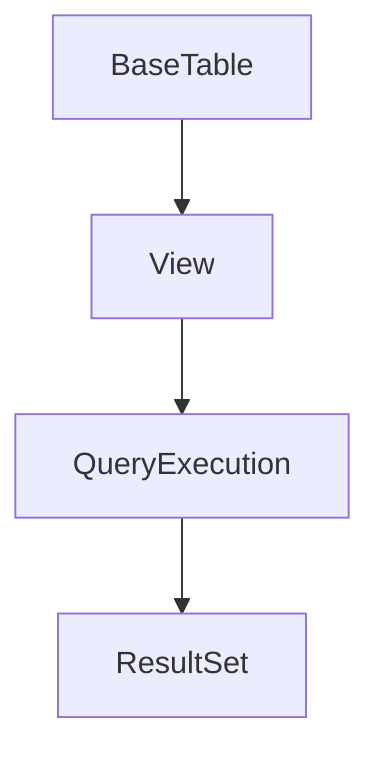

Example:

```sql
CREATE VIEW active_customers AS
SELECT customer_id, first_name, last_name
FROM customers;
```

---

### Stages

A **stage** is a storage location used to load data into Snowflake tables.

Stages allow users to store data files before executing loading operations.

Types of stages:

* Internal stages
* External stages
* Table stages
* User stages

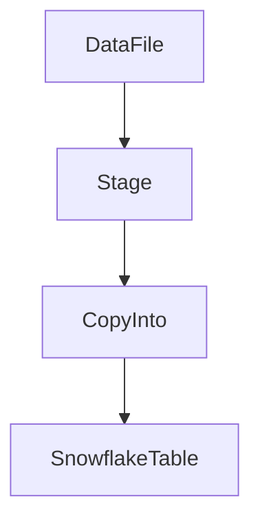

Example:

```sql
CREATE STAGE my_stage;
```

---

### File Formats

A **file format** defines how Snowflake interprets data files during loading operations.

Supported formats include:

* CSV
* JSON
* AVRO
* PARQUET
* ORC
* XML

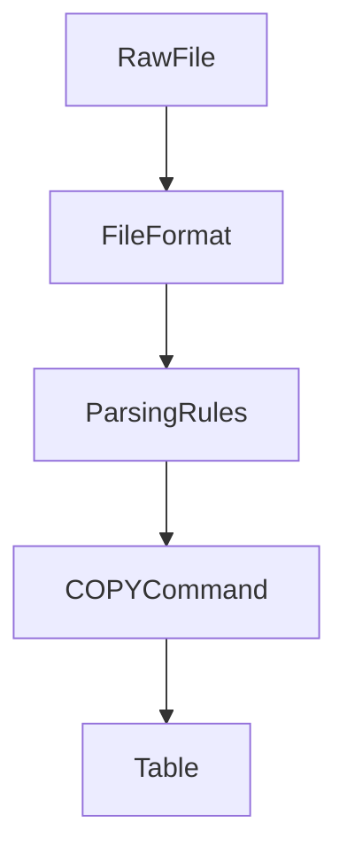

Example:

```sql
CREATE FILE FORMAT csv_format
TYPE = CSV
FIELD_DELIMITER = ','
SKIP_HEADER = 1;
```

---

### Sequences

A **sequence** is a database object used to generate unique numeric values.

Sequences are often used to generate identifiers such as primary keys.

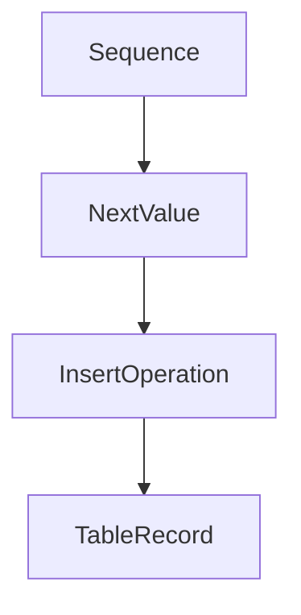

Example:

```sql
CREATE SEQUENCE order_seq START = 1 INCREMENT = 1;
```

---

### Streams

A **stream** records changes made to a table such as inserts, updates, and deletes.

Streams enable **change data capture (CDC)** pipelines.

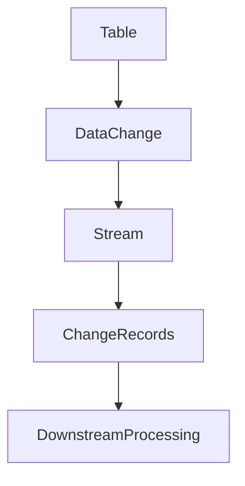

Example:

```sql
CREATE STREAM customer_stream
ON TABLE customers;
```

---

### Tasks

A **task** is used to schedule SQL operations or automate data pipelines.

Tasks can run on:

* Fixed schedules
* Event triggers
* Dependency chains

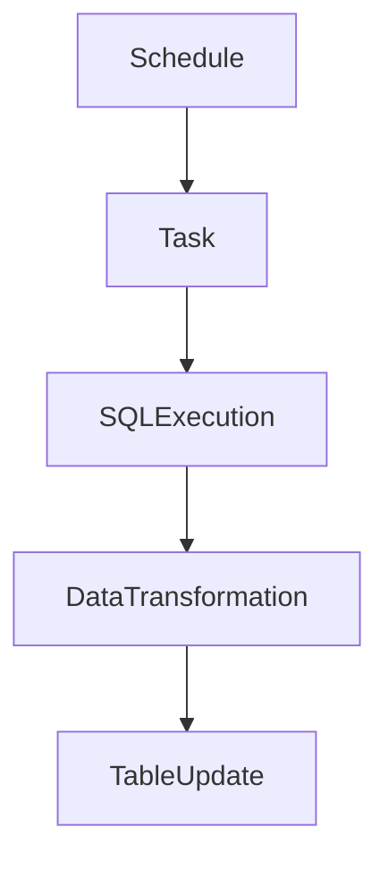

Example:

```sql
CREATE TASK refresh_sales
WAREHOUSE = compute_wh
SCHEDULE = '1 HOUR'
AS
INSERT INTO sales_summary
SELECT * FROM sales_stream;
```

---

## Advanced Data Objects

Snowflake also supports advanced objects used for analytics and external data access.

---

### External Tables

External tables allow Snowflake to query data stored in external cloud storage such as Amazon S3.

The data remains outside Snowflake but can be queried like a normal table.

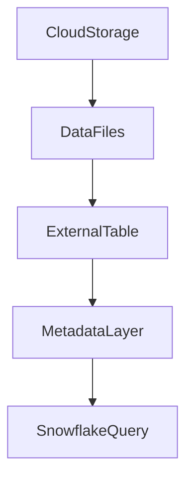

Example:

```sql
CREATE EXTERNAL TABLE ext_sales
LOCATION = @s3_stage/sales
FILE_FORMAT = (TYPE = PARQUET);
```

---

### Materialized Views

A **materialized view** stores the results of a query physically. Snowflake automatically maintains the data when underlying tables change.

Materialized views improve performance for repeated complex queries.

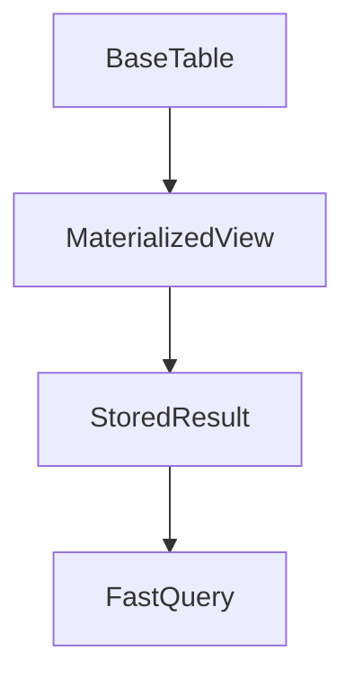

Example:

```sql
CREATE MATERIALIZED VIEW sales_summary_mv AS
SELECT product_id, SUM(amount) AS total_sales
FROM sales
GROUP BY product_id;
```

---

## Table Types

Snowflake provides multiple table types optimized for different workloads.

Types include:

* Permanent tables
* Transient tables
* Temporary tables

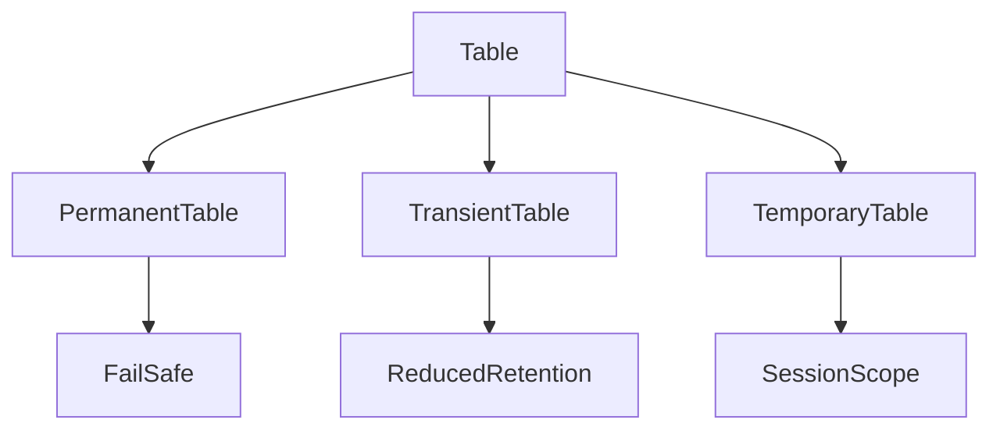

---

## Data Retention and Time Travel

Snowflake provides **Time Travel**, which allows users to query historical versions of data.

Time Travel supports:

* Recovering deleted data
* Querying past states of tables
* Data auditing

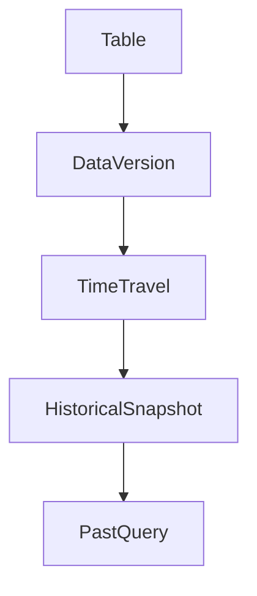

Example:

```sql
SELECT * FROM customers
AT (TIMESTAMP => '2025-01-01 10:00:00');
```

---
## Schema Separation

Separate environments.
| Schema    | Purpose             |
| --------- | ------------------- |
| raw       | Ingested raw data   |
| staging   | Data transformation |
| analytics | Reporting models    |

## Summary

Snowflake data objects provide the building blocks for storing, managing, and querying data.

Core objects:

* Databases
* Schemas
* Tables
* Views
* Stages
* File Formats
* Sequences
* Streams
* Tasks

Advanced objects:

* External Tables
* Materialized Views
* Table Types
* Time Travel

Understanding these objects is essential for designing scalable data platforms and building production-grade Snowflake architectures.
