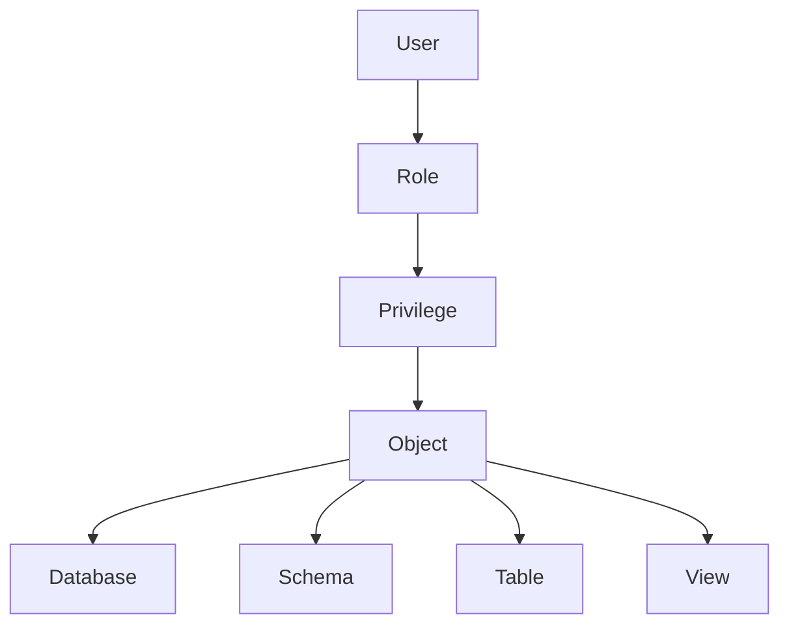
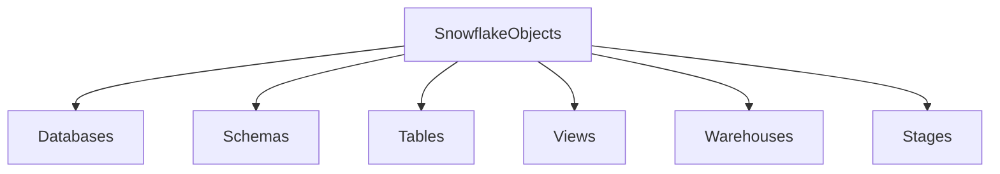
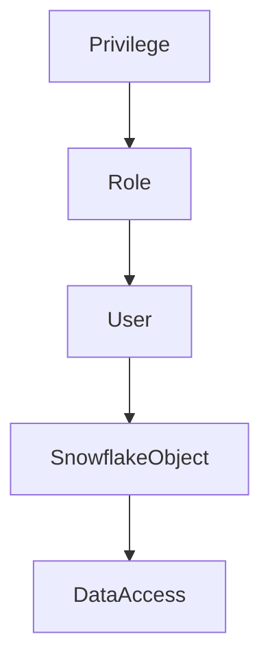
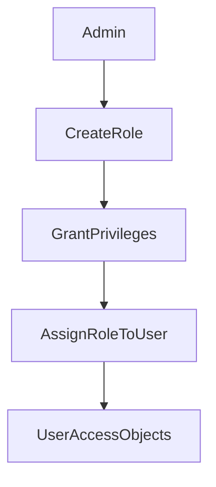

# RBAC Overview in Snowflake

## Introduction

Role Based Access Control (RBAC) is the core security model used in Snowflake to control access to data and platform resources. RBAC ensures that users can only access the data and perform the operations that their assigned roles allow.

Instead of assigning permissions directly to users, Snowflake follows a structured model where privileges are granted to roles, and roles are assigned to users. This approach simplifies security management and enables scalable governance across large organizations.

RBAC determines:

* Who can access the Snowflake account
* Which objects they can interact with
* What operations they are allowed to perform

Snowflake RBAC connects four main elements:

* Users
* Roles
* Privileges
* Objects



---

## Core RBAC Components

Snowflake RBAC consists of several fundamental components that work together to enforce security policies.

### Users

Users represent identities that authenticate and log in to Snowflake. A user account can belong to one or more roles, which determine the level of access the user receives.

Each user typically has:

* A login name
* Authentication credentials
* A default role
* Assigned roles

Example user creation:

```sql
CREATE USER analyst_user
PASSWORD='StrongPassword'
DEFAULT_ROLE=analyst_role;
```

In this example, the user `analyst_user` will operate under the `analyst_role` by default.

---

### Roles

Roles act as containers for privileges. Instead of granting permissions directly to users, administrators assign privileges to roles.

Users receive access by being assigned those roles.

This design provides centralized permission management and simplifies access control in large environments.

Example role creation:

```sql
CREATE ROLE analyst_role;
```

Roles can later be assigned to users or other roles.

---

### Privileges

Privileges define what actions a role can perform on a specific object.

Snowflake provides many privileges depending on the type of object.

Common privileges include:

* SELECT
* INSERT
* UPDATE
* DELETE
* USAGE
* CREATE
* MODIFY
* OWNERSHIP

Example privilege assignment:

```sql
GRANT SELECT ON TABLE sales TO ROLE analyst_role;
```

This allows the role `analyst_role` to query the `sales` table.

---

### Objects

Objects are Snowflake resources that roles can interact with.

Examples of Snowflake objects include:

* Databases
* Schemas
* Tables
* Views
* Warehouses
* Stages
* File formats
* Sequences

Privileges define how roles interact with these objects.



---

## RBAC Permission Model

In the Snowflake RBAC model, permissions flow through roles before reaching users.

This layered approach allows administrators to maintain centralized control over access policies.



The permission flow works as follows:

1. Privileges are granted to a role.
2. Roles are assigned to users.
3. Users access Snowflake objects through the assigned roles.

---

## Role Assignment Flow

RBAC permissions follow a structured workflow that defines how access is granted within the Snowflake environment.



Explanation of the process:

1. An administrator creates a role.
2. Privileges are granted to that role.
3. The role is assigned to one or more users.
4. Users gain access to Snowflake objects through their roles.

This workflow allows administrators to manage access in a controlled and scalable way.

---

## Example RBAC Workflow

The following example demonstrates a typical RBAC setup process.

Step 1: Create a role

```sql
CREATE ROLE analyst_role;
```

Step 2: Grant privileges to the role

```sql
GRANT SELECT ON TABLE sales TO ROLE analyst_role;
```

Step 3: Create a user

```sql
CREATE USER analyst_user
PASSWORD='StrongPassword'
DEFAULT_ROLE=analyst_role;
```

Step 4: Assign the role to the user

```sql
GRANT ROLE analyst_role TO USER analyst_user;
```

After these steps, the user `analyst_user` can query the `sales` table using the privileges granted through the role.

---

## Summary

Snowflake RBAC provides a structured and scalable approach to managing access control.

The RBAC model includes four core elements:

* Users
* Roles
* Privileges
* Objects

Key principles of the Snowflake RBAC model:

* Permissions are granted to roles instead of users
* Users inherit permissions through assigned roles
* Roles provide centralized permission management
* Access to Snowflake objects is controlled through privileges

This model ensures secure, maintainable, and scalable access control across the Snowflake platform.
