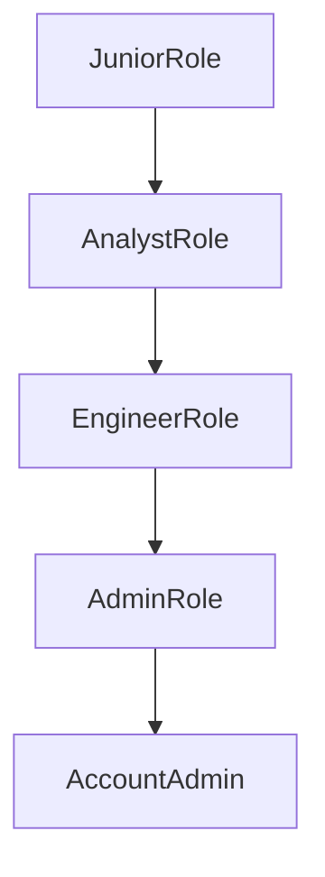
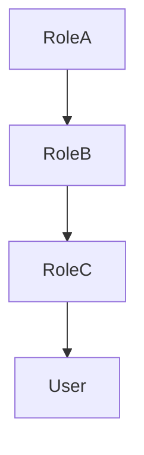
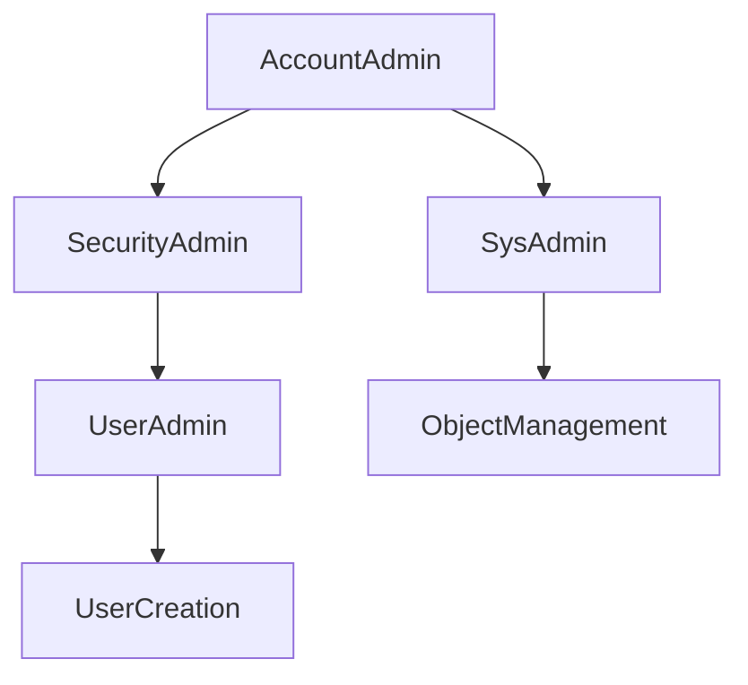
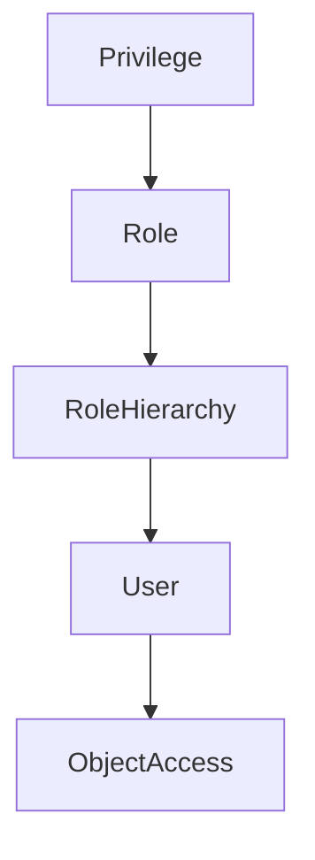
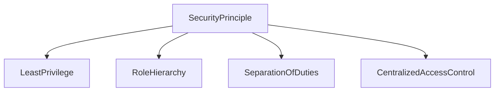

# Role Hierarchy and System Roles in Snowflake

## Role Hierarchy in Snowflake

Snowflake supports a **role hierarchy**, which allows one role to inherit privileges from another role. This mechanism enables administrators to build layered access models where higher-level roles automatically receive the permissions granted to lower-level roles.

Role hierarchy simplifies access management because permissions do not need to be granted repeatedly to multiple roles. Instead, roles can inherit privileges through the hierarchy.



In this hierarchy:

* `AnalystRole` inherits permissions from `JuniorRole`
* `EngineerRole` inherits permissions from `AnalystRole`
* `AdminRole` inherits permissions from `EngineerRole`
* `AccountAdmin` inherits permissions from all lower roles

Example role inheritance:

```sql
GRANT ROLE analyst_role TO ROLE engineer_role;
```

This means the `engineer_role` automatically receives all privileges granted to `analyst_role`.

---

## Role Inheritance Model

Role inheritance allows privileges to propagate through multiple levels of roles. When a role is granted to another role, all privileges assigned to the parent role are inherited by the child role.

This inheritance continues until the privileges reach the user.



Example scenario:

* `RoleA` has `SELECT` privilege on a table
* `RoleB` inherits privileges from `RoleA`
* `RoleC` inherits privileges from `RoleB`
* A user assigned `RoleC` receives the `SELECT` privilege

This hierarchical structure enables scalable and maintainable access control.

---

## Snowflake System Roles

Snowflake provides several built-in system roles that are designed to manage different administrative responsibilities within the account. These roles help enforce separation of duties.

Important system roles include:

### ACCOUNTADMIN

`ACCOUNTADMIN` is the highest-level role in Snowflake. It has full control over the Snowflake account and can perform any administrative action.

Responsibilities include:

* Managing account-level configurations
* Monitoring usage and billing
* Managing security policies
* Managing role hierarchy

---

### SECURITYADMIN

`SECURITYADMIN` is responsible for security administration.

Responsibilities include:

* Creating and managing roles
* Granting and revoking privileges
* Managing network policies
* Managing security policies

---

### SYSADMIN

`SYSADMIN` manages database objects and compute resources.

Responsibilities include:

* Creating databases and schemas
* Managing warehouses
* Managing tables, views, and stages

---

### USERADMIN

`USERADMIN` is responsible for managing user accounts.

Responsibilities include:

* Creating users
* Managing role assignments
* Maintaining user credentials

---

### PUBLIC

`PUBLIC` is a default role automatically granted to every Snowflake user. It provides minimal access and is typically used for shared objects that all users can access.



This structure supports clear separation of responsibilities between system administrators and security administrators.

---

## Privilege Grant Flow

In Snowflake RBAC, privileges flow through roles before reaching users. This ensures centralized management of access permissions.



The flow works as follows:

1. Privileges are granted to a role.
2. The role may be part of a role hierarchy.
3. Users are assigned roles.
4. Users access objects through the privileges granted to their roles.

Example privilege grant:

```sql
GRANT USAGE ON DATABASE sales_db TO ROLE analyst_role;
GRANT ROLE analyst_role TO USER analyst_user;
```

After this assignment, `analyst_user` can access the `sales_db` database through the `analyst_role`.

---

## Best Practices for RBAC Design

Designing RBAC correctly is essential for maintaining secure and scalable access control in Snowflake.

Key principles include:

### Use Role Hierarchies

Role hierarchies reduce complexity by allowing privileges to be inherited instead of repeatedly assigned.

### Separate Administrative Duties

Different roles should manage different responsibilities such as user management, security management, and object creation.

### Avoid Direct Privilege Assignment to Users

Privileges should always be assigned to roles rather than users.

### Apply the Principle of Least Privilege

Users should receive only the permissions necessary to perform their tasks.



Following these principles ensures that Snowflake environments remain secure, maintainable, and compliant with enterprise security standards.
