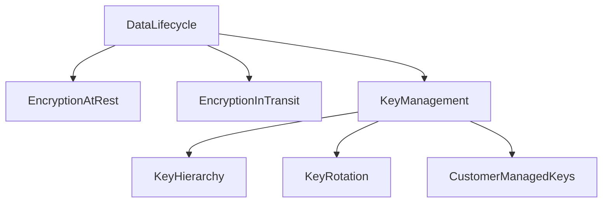
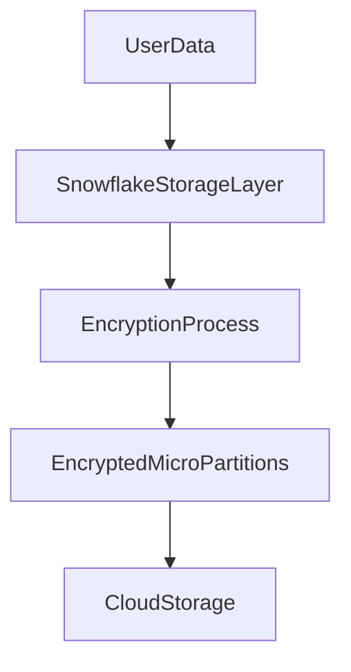
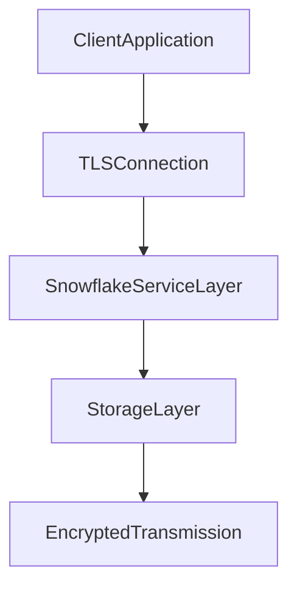
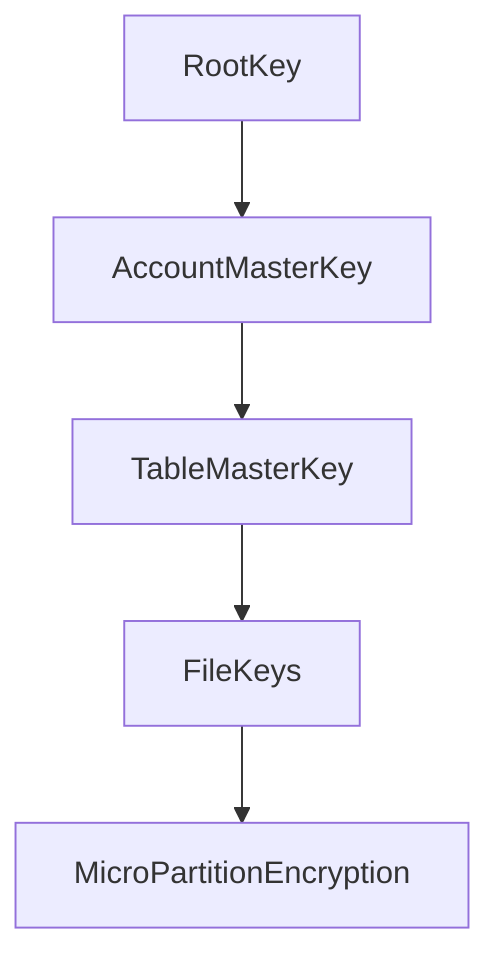
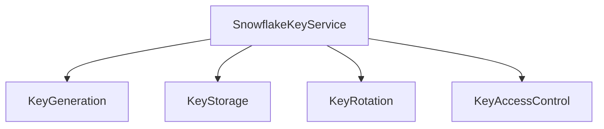
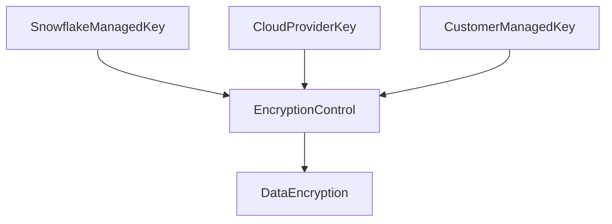
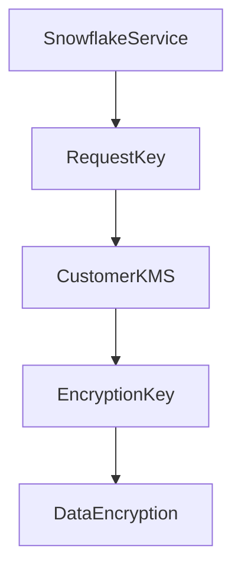
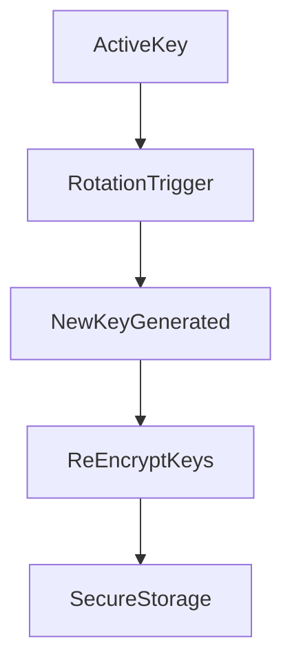
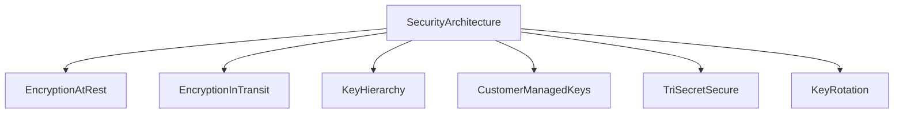

# Snowflake Encryption Architecture

## Overview

Snowflake provides a built-in encryption architecture that protects data at every stage of its lifecycle. All data stored and processed within Snowflake is encrypted automatically without requiring manual configuration.

Snowflake encryption covers three primary areas:

* Encryption at rest
* Encryption in transit
* Key management and hierarchy

The encryption framework ensures that sensitive data remains protected while meeting compliance requirements such as GDPR, HIPAA, and SOC standards.

---

# Encryption at Rest

Encryption at rest protects data stored in Snowflake storage layers. Every piece of data stored in Snowflake is encrypted using strong encryption algorithms.

Snowflake uses **AES-256 encryption** to secure stored data.

Data encrypted at rest includes:

* Table data
* Micro-partitions
* Metadata
* Internal stage files
* Query results stored in cache

Snowflake automatically encrypts data before it is written to cloud storage.

### Encryption Process

1. Data is written to Snowflake tables.
2. Snowflake divides the data into micro-partitions.
3. Each micro-partition is encrypted using encryption keys.
4. Encrypted data is stored in cloud storage.

Users never interact directly with encryption operations because Snowflake manages them automatically.

---

# Encryption in Transit

Encryption in transit protects data while it moves between systems.

This includes:

* Client connections to Snowflake
* Data movement between Snowflake services
* Communication between compute and storage layers

Snowflake uses **TLS (Transport Layer Security)** to encrypt all network traffic.

The encryption ensures:

* Data cannot be intercepted during transmission
* Communication channels remain secure
* Man-in-the-middle attacks are prevented

---

# Snowflake Key Hierarchy

Snowflake uses a layered key hierarchy to manage encryption keys securely. Instead of using a single key, Snowflake implements multiple levels of keys to improve security and isolation.

Key hierarchy structure:

### Key Levels

**Root Key**

The root key is the highest level key used to protect account master keys.

**Account Master Key**

Each Snowflake account has its own master key used to encrypt lower-level keys.

**Table Master Key**

Table keys are used to encrypt data stored in tables.

**File Keys**

File keys encrypt individual micro-partitions or data files.

This layered structure ensures that compromise of one key does not expose the entire system.

---

# Key Management in Snowflake

Snowflake manages encryption keys automatically through a secure internal key management service.

Responsibilities handled by Snowflake include:

* Key generation
* Key storage
* Key rotation
* Key access control
* Key lifecycle management

Keys are stored in highly secure key management systems integrated with the cloud provider.

Users do not need to manually manage encryption keys unless advanced security configurations are required.

---

# Tri-Secret Secure

Tri-Secret Secure is an advanced security feature that introduces an additional layer of encryption control using customer-managed keys.

In this model, three secrets protect the encryption system:

1. Snowflake managed key
2. Cloud provider key
3. Customer managed key

All three keys must work together for encryption and decryption operations.

This architecture ensures that:

* Snowflake cannot decrypt data alone
* Cloud providers cannot decrypt data alone
* Customer maintains additional control over encryption

Tri-Secret Secure is commonly used in highly regulated environments.

---

# Customer Managed Keys (CMK)

Customer Managed Keys allow organizations to manage their own encryption keys using cloud provider key management services.

Examples:

* AWS Key Management Service (AWS KMS)
* Azure Key Vault
* Google Cloud KMS

With CMK enabled:

* Snowflake requests keys from the customer's key management system
* The customer controls key access policies
* Key revocation immediately blocks data access

This model provides stronger control over encryption and compliance policies.

---

# Key Rotation

Key rotation is the process of periodically replacing encryption keys to reduce security risks.

Snowflake automatically rotates encryption keys without requiring downtime or manual intervention.

Key rotation benefits include:

* Reducing the impact of compromised keys
* Improving long-term security
* Meeting compliance requirements

During key rotation:

1. A new key is generated.
2. Existing keys are re-encrypted.
3. Data remains continuously accessible.

Users experience no disruption during this process.

---

# Encryption Security Layers

Snowflake encryption operates across multiple security layers.

These layers ensure strong protection against unauthorized access.

---

# Summary

Snowflake encryption architecture protects data throughout its lifecycle using multiple security mechanisms.

Key components include:

* Encryption at rest using AES-256
* Encryption in transit using TLS
* Multi-layer key hierarchy
* Automatic key management
* Customer managed keys
* Tri-Secret Secure
* Automatic key rotation

This architecture ensures strong protection of sensitive data while maintaining high performance and operational simplicity.
