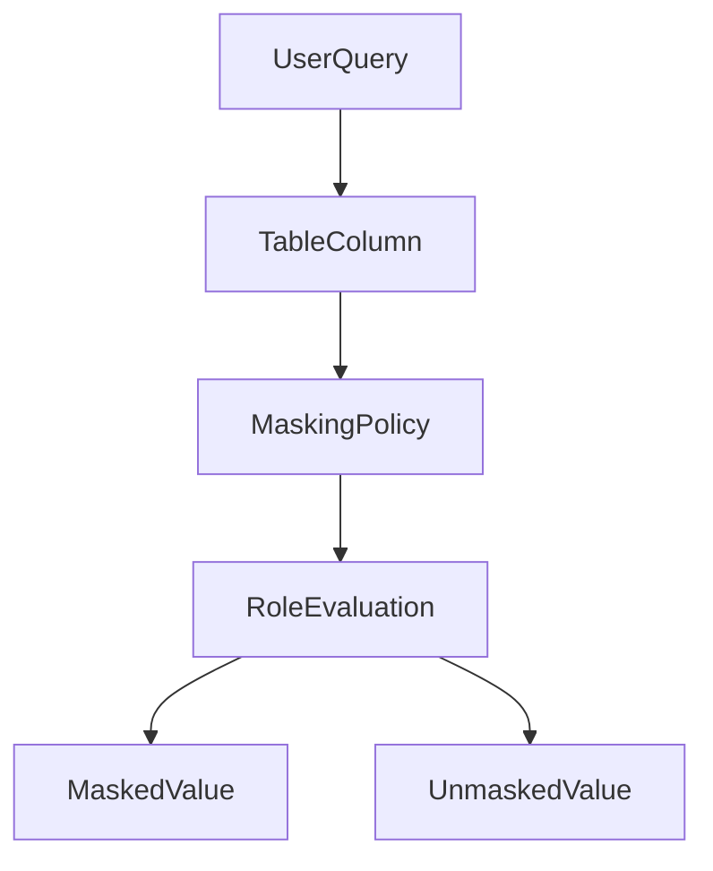
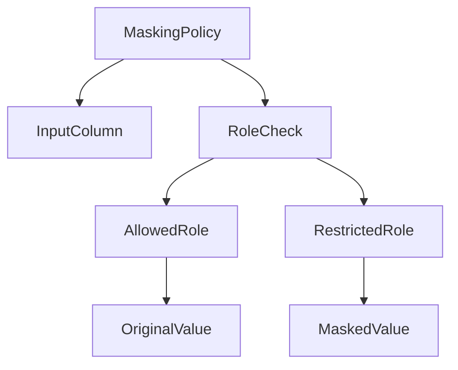
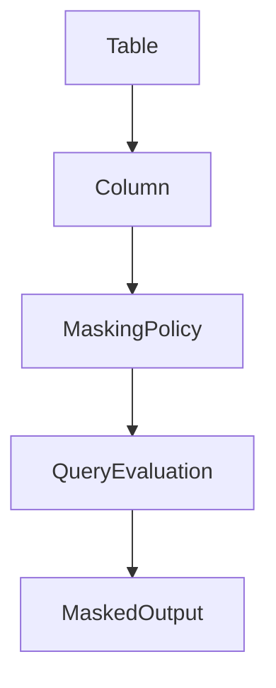
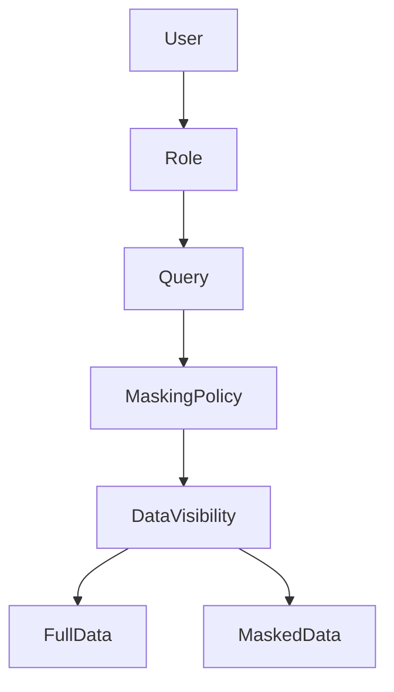
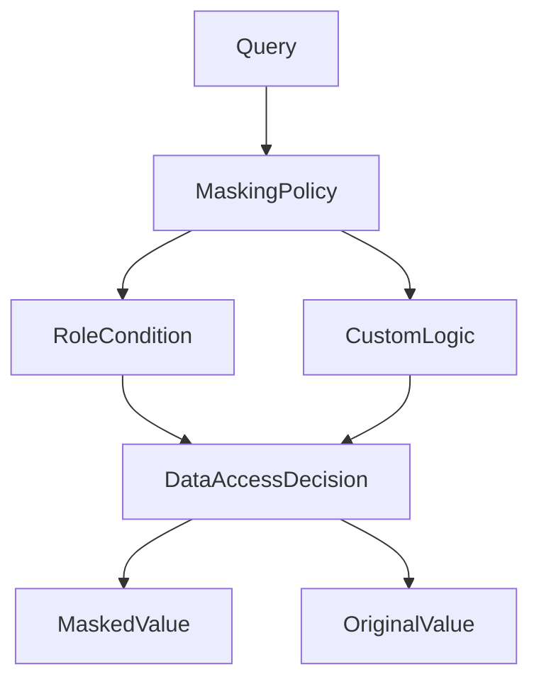
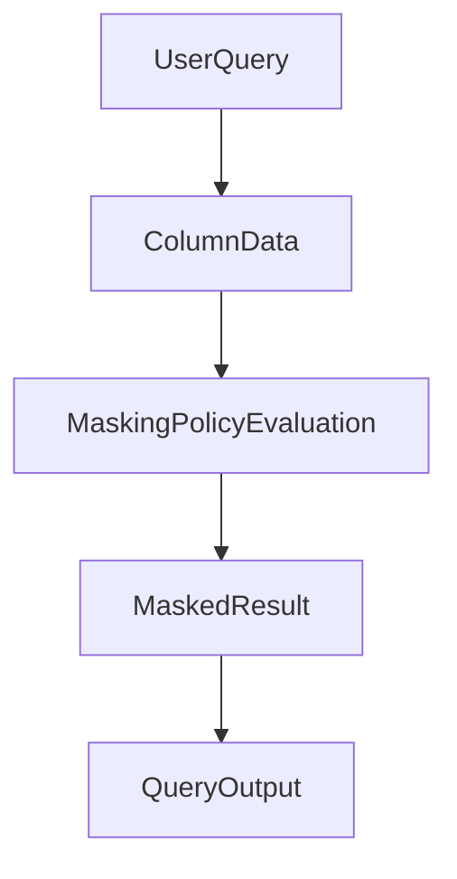
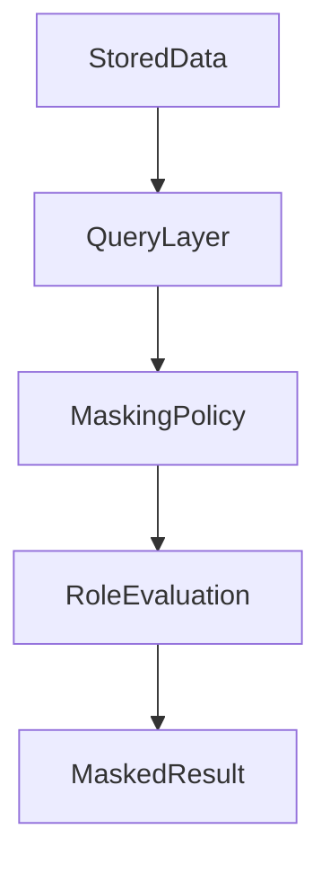
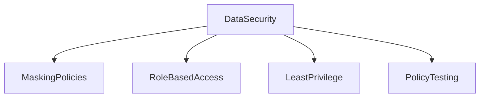

# Dynamic Data Masking in Snowflake

## Overview

Dynamic Data Masking is a Snowflake security feature used to protect sensitive data by masking column values when queried by unauthorized users. The actual data stored in the table remains unchanged, but the query result displays masked values depending on the user's role.

Masking policies allow organizations to enforce data protection rules without modifying the underlying data.

Common use cases include masking:

* Personally identifiable information (PII)
* Credit card numbers
* Email addresses
* Phone numbers
* Financial records



---

# Masking Policies

A masking policy defines the rules used to determine how a column should be masked. These policies are attached to table columns and evaluated whenever the column is queried.

Masking policies evaluate the role of the user and apply conditional logic to determine whether the value should be visible or masked.



Masking policies are reusable and can be applied to multiple tables or columns.

---

# Creating a Masking Policy

A masking policy defines both the column data type and the logic used to mask the data.

Example masking policy for email addresses:

```sql
CREATE MASKING POLICY email_mask AS
(val STRING)
RETURNS STRING ->
CASE
    WHEN CURRENT_ROLE() IN ('SECURITYADMIN','DATA_ENGINEER')
        THEN val
    ELSE '********@company.com'
END;
```

Explanation:

* The policy checks the current role.
* Authorized roles see the real value.
* Other roles see a masked version.

---

# Applying Masking Policies to Columns

Masking policies are attached to specific columns in tables.

Once attached, every query on that column automatically evaluates the masking policy.



Example table:

```sql
CREATE TABLE customers (
    customer_id INT,
    name STRING,
    email STRING
);
```

Attach masking policy:

```sql
ALTER TABLE customers
MODIFY COLUMN email
SET MASKING POLICY email_mask;
```

Now the `email` column will follow the masking policy during queries.

---

# Role Based Masking

Dynamic masking is typically implemented using role-based logic. The masking policy checks the role executing the query and determines what value should be returned.



Example role-based masking logic:

```sql
CREATE MASKING POLICY phone_mask AS
(val STRING)
RETURNS STRING ->
CASE
    WHEN CURRENT_ROLE() = 'ADMIN_ROLE'
        THEN val
    ELSE 'XXX-XXX-XXXX'
END;
```

This ensures only administrators can view real phone numbers.

---

# Conditional Masking Logic

Masking policies can include complex conditional logic. Conditions can evaluate roles, functions, or other contextual information.



Example conditional policy:

```sql
CREATE MASKING POLICY ssn_mask AS
(val STRING)
RETURNS STRING ->
CASE
    WHEN CURRENT_ROLE() IN ('HR_ROLE','SECURITYADMIN')
        THEN val
    ELSE 'XXX-XX-XXXX'
END;
```

This allows HR roles to view sensitive identifiers while masking them for other users.

---

# Query Behavior with Masking

When a user queries a masked column, Snowflake automatically evaluates the masking policy before returning results.



Example query:

```sql
SELECT name, email FROM customers;
```

Results differ depending on the role:

Authorized role:

```
John   john@example.com
```

Unauthorized role:

```
John   ********@company.com
```

---

# Viewing Masking Policies

Administrators can view existing masking policies using system commands.

```sql
SHOW MASKING POLICIES;
```

To describe a masking policy:

```sql
DESCRIBE MASKING POLICY email_mask;
```

---

# Removing a Masking Policy

A masking policy can be removed from a column if it is no longer required.

```sql
ALTER TABLE customers
MODIFY COLUMN email
UNSET MASKING POLICY;
```

---

# Dynamic Masking Architecture

Dynamic data masking works at the query layer rather than the storage layer.



Key properties:

* Data remains unchanged in storage
* Masking occurs during query execution
* Policies are centrally managed

---

# Best Practices

Design masking policies carefully to maintain both security and usability.

Recommended practices include:

Use masking policies for all sensitive columns.

Create centralized reusable policies.

Combine masking with RBAC roles.

Restrict sensitive data access to minimal roles.

Test policies with multiple roles before production deployment.



---

# Summary

Dynamic Data Masking in Snowflake protects sensitive information while allowing controlled access to data.

Key concepts include:

* Masking policies
* Role-based masking
* Conditional masking logic
* Column-level enforcement
* Query-time evaluation

Dynamic masking enables organizations to maintain data privacy without altering stored data or creating duplicate datasets.
