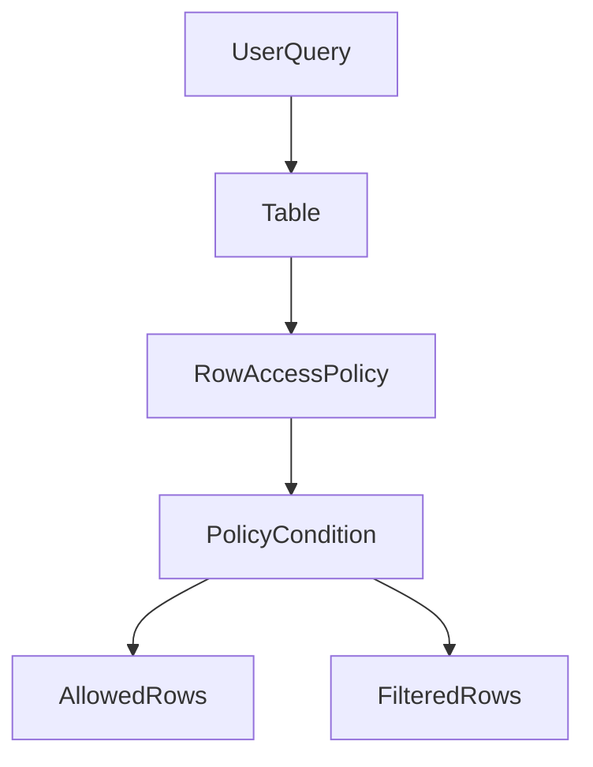
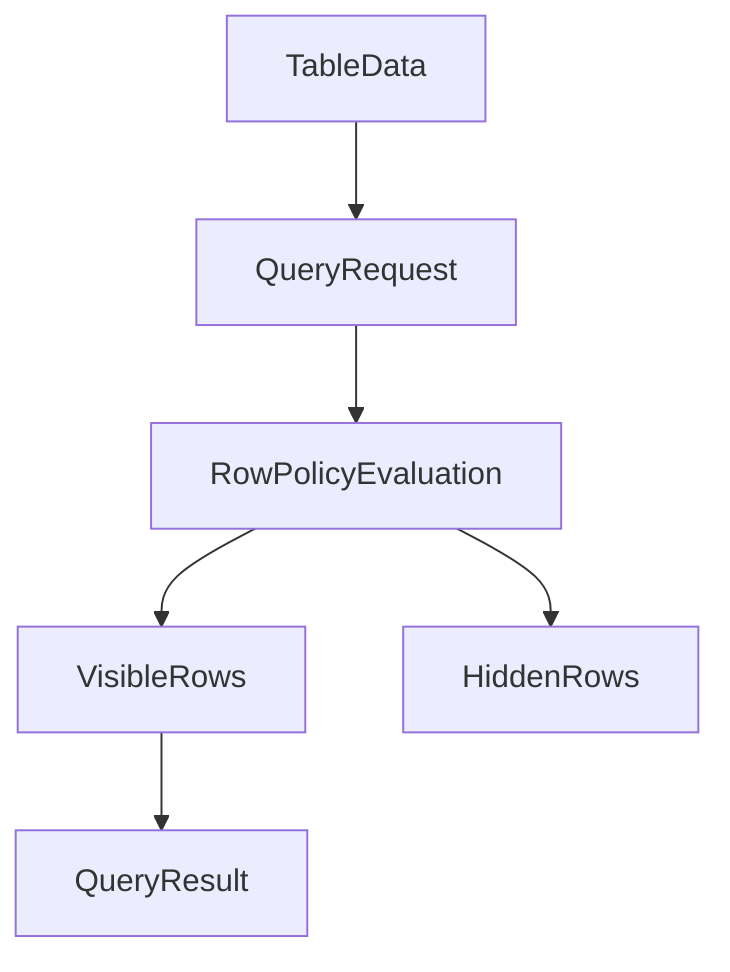
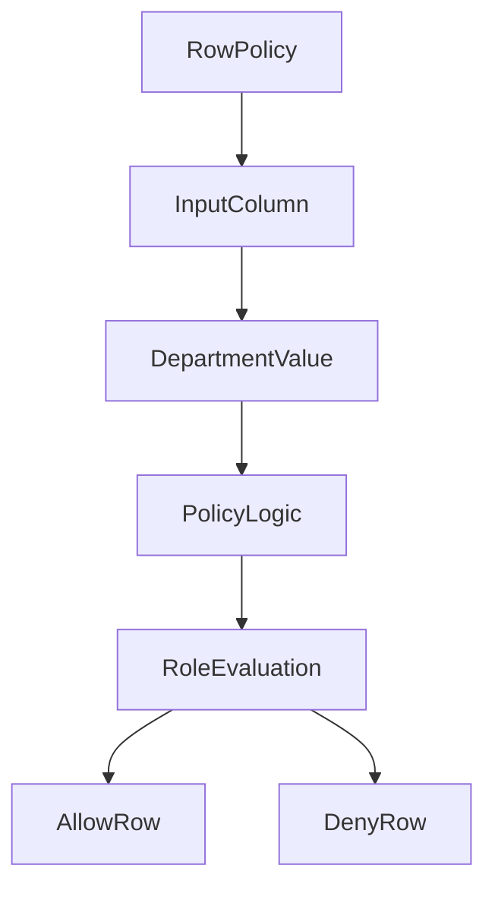
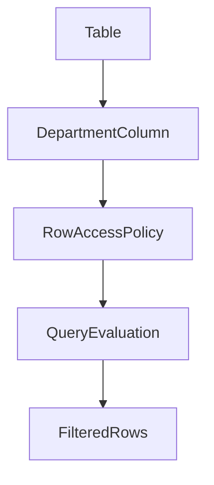
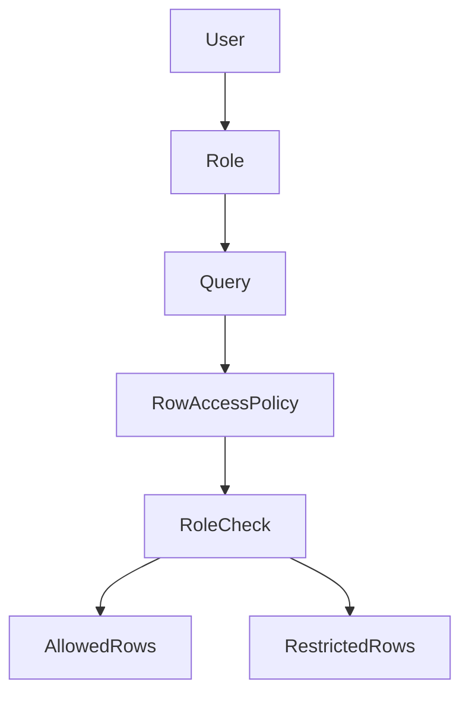
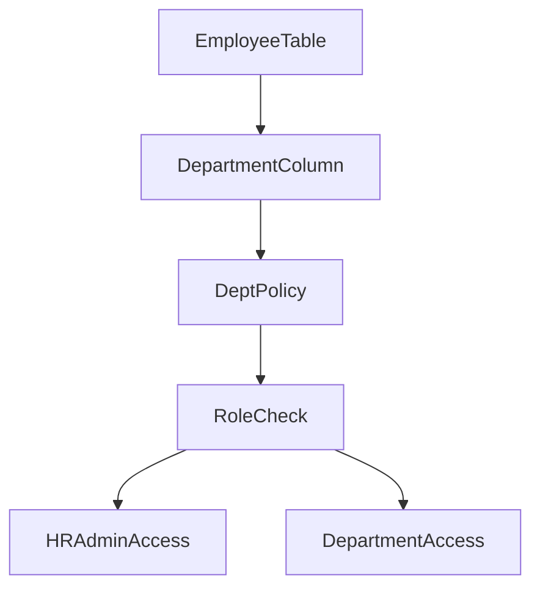
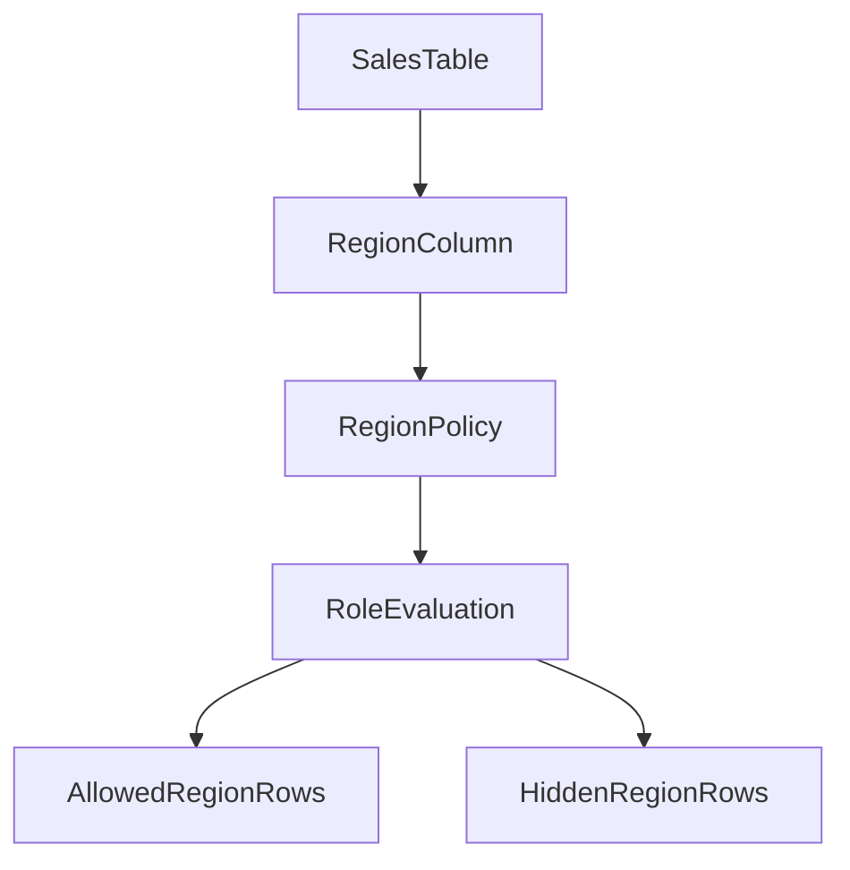
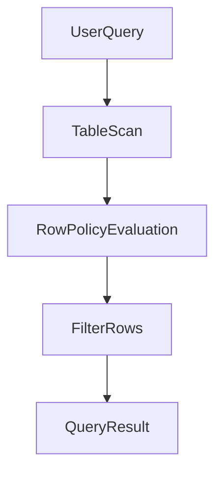
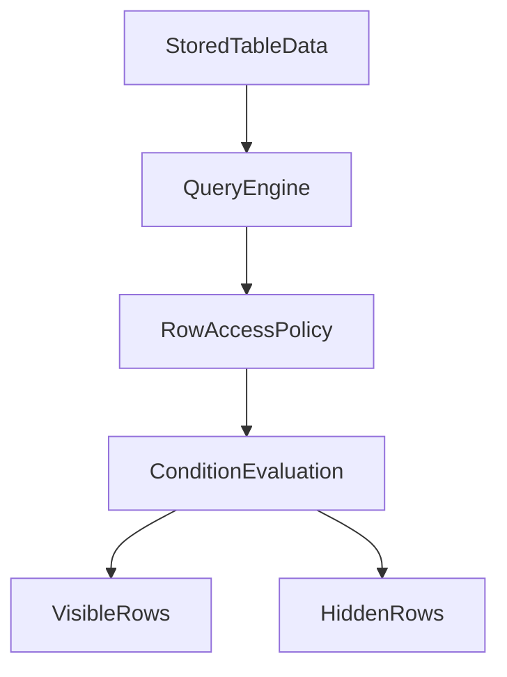
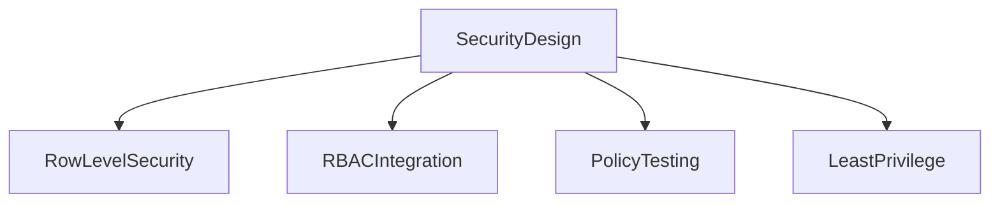

# Row Access Policies in Snowflake

## Overview

Row Access Policies provide **row-level security** in Snowflake. They control which rows of a table are visible to a user based on conditions such as role, department, or region.

Instead of creating multiple tables or views for different users, Snowflake dynamically filters rows during query execution.

Row Access Policies ensure that users only see the rows they are authorized to access.

Common use cases include:

* Restricting data by department
* Restricting data by geographic region
* Restricting customer data by account owner
* Implementing multi-tenant data isolation



---

# Row-Level Security Concept

Row-level security ensures that different users querying the same table may receive different results based on their roles or attributes.

The policy evaluates conditions during query execution and returns only the rows that satisfy the policy rules.



This approach removes the need to maintain separate tables or views for different user groups.

---

# Creating a Row Access Policy

A Row Access Policy defines the filtering condition applied to rows in a table. The policy returns a Boolean value indicating whether the row should be visible.

Example policy restricting access by department:

```sql
CREATE ROW ACCESS POLICY department_policy
AS (department STRING)
RETURNS BOOLEAN ->
CURRENT_ROLE() IN ('HR_ROLE','ADMIN_ROLE')
OR department = CURRENT_ROLE();
```

Explanation:

* If the role is HR or ADMIN, all rows are visible.
* Other roles can only see rows where the department matches their role.



---

# Attaching Row Access Policies to Tables

After creating the policy, it must be attached to a table column that contains the filtering attribute.

Example table:

```sql
CREATE TABLE employees (
    employee_id INT,
    name STRING,
    department STRING,
    salary NUMBER
);
```

Attach the row access policy:

```sql
ALTER TABLE employees
ADD ROW ACCESS POLICY department_policy
ON (department);
```

Once applied, every query on the table automatically evaluates the policy.



---

# Role-Based Row Filtering

Row Access Policies commonly use roles to determine which rows a user can access.

Snowflake provides functions such as:

* `CURRENT_ROLE()`
* `CURRENT_USER()`
* `IS_ROLE_IN_SESSION()`

These functions allow policies to evaluate the context of the user executing the query.



Example role-based policy:

```sql
CREATE ROW ACCESS POLICY sales_region_policy
AS (region STRING)
RETURNS BOOLEAN ->
region = CURRENT_ROLE()
OR CURRENT_ROLE() = 'SALES_ADMIN';
```

Behavior:

* `SALES_ADMIN` sees all regions
* Other roles see only their assigned region

---

# Example: Restricting Rows by Department

Table structure:

```sql
CREATE TABLE employee_data (
    employee_id INT,
    employee_name STRING,
    department STRING,
    salary NUMBER
);
```

Policy restricting department access:

```sql
CREATE ROW ACCESS POLICY dept_policy
AS (department STRING)
RETURNS BOOLEAN ->
department = CURRENT_ROLE()
OR CURRENT_ROLE() = 'HR_ADMIN';
```

Attach policy:

```sql
ALTER TABLE employee_data
ADD ROW ACCESS POLICY dept_policy
ON (department);
```



Result:

* HR_ADMIN sees all employees
* SALES role sees only employees in the SALES department

---

# Example: Restricting Rows by Region

Table structure:

```sql
CREATE TABLE sales_data (
    order_id INT,
    region STRING,
    revenue NUMBER
);
```

Policy for region-based access:

```sql
CREATE ROW ACCESS POLICY region_policy
AS (region STRING)
RETURNS BOOLEAN ->
region = CURRENT_ROLE()
OR CURRENT_ROLE() = 'GLOBAL_MANAGER';
```

Attach policy:

```sql
ALTER TABLE sales_data
ADD ROW ACCESS POLICY region_policy
ON (region);
```



Results:

* `GLOBAL_MANAGER` sees all sales data
* `US_ROLE` sees only US region data
* `EU_ROLE` sees only EU region data

---

# Query Behavior with Row Access Policies

When a user queries the table, Snowflake automatically applies the row filtering logic before returning the result.



Example query:

```sql
SELECT * FROM sales_data;
```

Results returned depend on the user's role and the policy conditions.

---

# Viewing Row Access Policies

Administrators can view row access policies in the account.

List policies:

```sql
SHOW ROW ACCESS POLICIES;
```

Describe policy:

```sql
DESCRIBE ROW ACCESS POLICY region_policy;
```

---

# Removing a Row Access Policy

To remove a policy from a table:

```sql
ALTER TABLE sales_data
DROP ROW ACCESS POLICY region_policy;
```

This removes row-level restrictions from the table.

---

# Row Access Policy Architecture

Row Access Policies operate at the query evaluation layer.



Key characteristics:

* Policies are evaluated during query execution
* No duplicate datasets are required
* Centralized security rules enforce data access

---

# Best Practices

Use row access policies to protect multi-tenant or departmental data.

Keep policies simple and maintainable.

Use RBAC roles for consistent access control.

Test policies with multiple roles to ensure correct filtering behavior.



---

# Summary

Row Access Policies provide a powerful mechanism for implementing row-level security in Snowflake.

Key capabilities include:

* Filtering rows dynamically based on role or attributes
* Centralized security enforcement
* Integration with RBAC roles
* Support for department and region-based access control

This feature allows organizations to securely share a single dataset across multiple users while ensuring that each user only sees the data they are permitted to access.
