# Secure Views in Snowflake

## Overview

Secure Views are a special type of view in Snowflake designed to protect sensitive data and prevent exposure of the underlying query logic. They behave similarly to standard views but include additional security protections.

A Secure View ensures that users querying the view cannot access the underlying table structure, metadata, or query definition. This makes them suitable for controlled data sharing scenarios and for protecting confidential datasets.

Secure Views are commonly used in:

* Data sharing between organizations
* Protecting sensitive datasets
* Restricting access to raw tables
* Publishing curated datasets

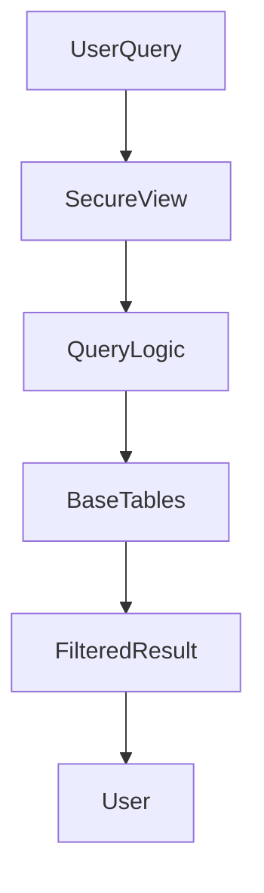

---

# Normal Views vs Secure Views

Snowflake supports two types of views:

* Standard Views
* Secure Views

A standard view exposes the query definition and may allow inference of underlying data structures through metadata.

Secure Views prevent exposure of query logic and protect metadata.

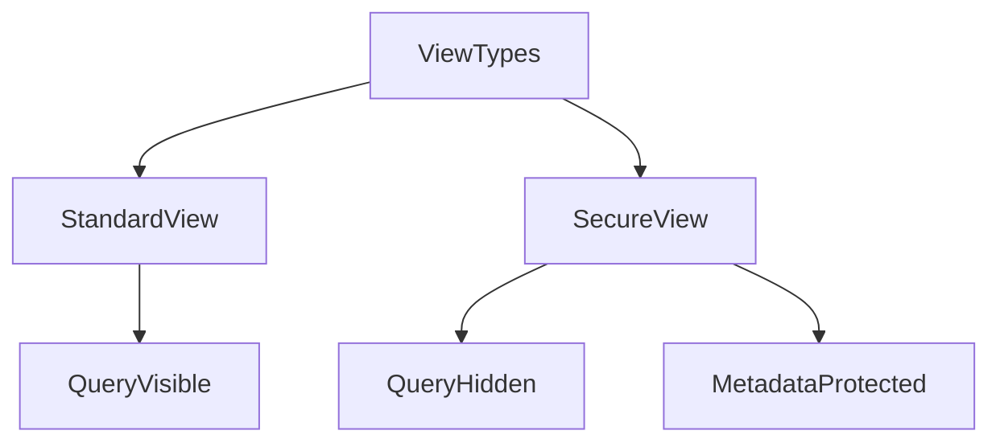

### Key Differences

Standard Views:

* Query definition can be visible to authorized users
* Metadata may expose underlying tables
* Less strict protection

Secure Views:

* Query definition hidden
* Metadata protected
* Required for secure data sharing

---

# Creating a Secure View

A Secure View is created by adding the `SECURE` keyword when defining the view.

Example:

```sql
CREATE SECURE VIEW customer_summary AS
SELECT customer_id, name, region
FROM customers;
```

Once created, Snowflake ensures that the underlying query and table structure remain protected.

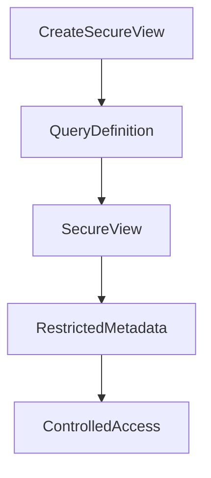

---

# How Secure Views Protect Query Logic

Secure Views prevent users from discovering the underlying SQL logic or data relationships.

Users querying the view can only see the result of the query, not how the result was generated.

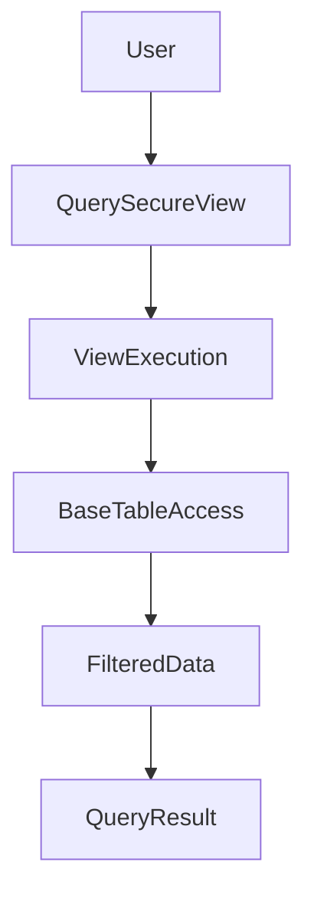

Key protections include:

* Hiding view definition
* Preventing inference attacks
* Protecting underlying table metadata

This ensures that business logic and transformation queries remain confidential.

---

# Metadata Protection

Secure Views prevent access to metadata that could reveal underlying data structures.

For example, users cannot retrieve view definitions using metadata queries.

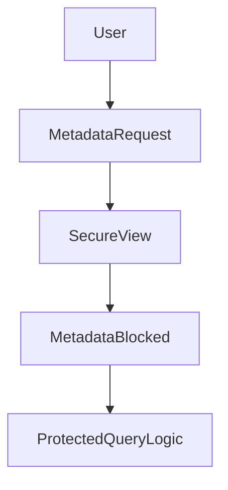

This prevents users from inspecting:

* View definitions
* Query logic
* Base table relationships

---

# Using Secure Views for Data Sharing

Secure Views are commonly used when sharing data across organizations through Snowflake Secure Data Sharing.

They allow providers to share curated datasets without exposing raw tables.

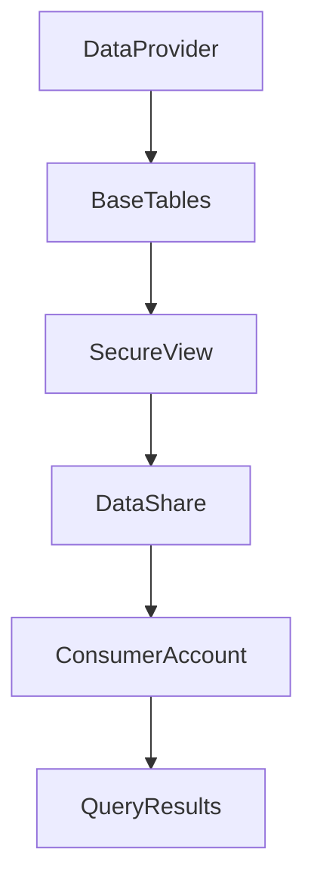

In this architecture:

* The provider exposes a Secure View
* The consumer queries the shared data
* The underlying tables remain hidden

---

# Example: Protecting Sensitive Columns

Suppose a company wants to expose customer data but hide sensitive columns such as credit card numbers.

Base table:

```sql
CREATE TABLE customers (
    customer_id INT,
    name STRING,
    email STRING,
    credit_card STRING
);
```

Create a Secure View that hides the sensitive column:

```sql
CREATE SECURE VIEW customer_public AS
SELECT customer_id, name, email
FROM customers;
```

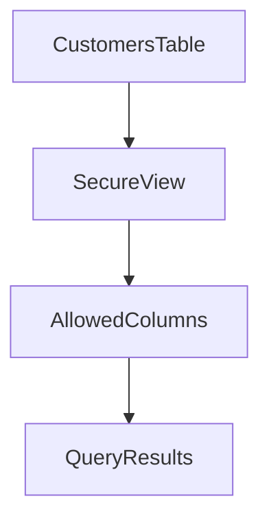

Users querying the Secure View will not see the credit card information.

---

# Secure View Execution Model

Secure Views operate within the Snowflake query engine but enforce additional security restrictions.

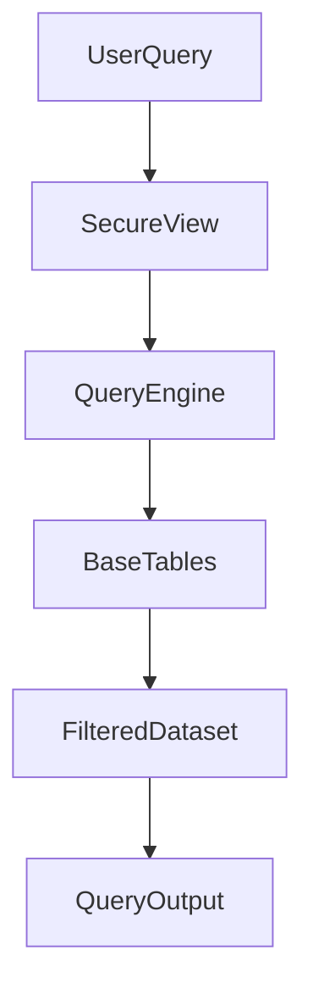

The view acts as a secure abstraction layer between users and raw data.

---

# Combining Secure Views with Other Security Features

Secure Views can be combined with other Snowflake security mechanisms.

Common combinations include:

* Dynamic Data Masking
* Row Access Policies
* RBAC roles

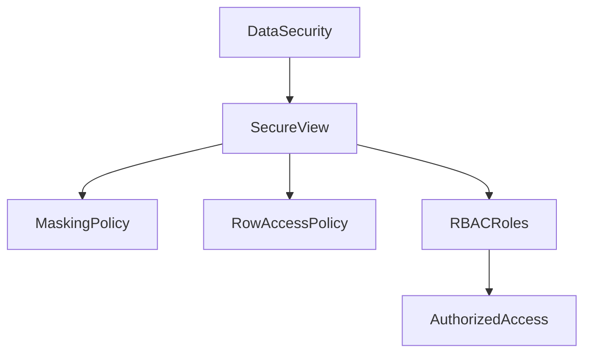

This layered approach provides strong protection for sensitive datasets.

---

# When to Use Secure Views

Secure Views should be used in scenarios where additional protection is required for data exposure.

Common scenarios include:

Sensitive datasets:

* Financial data
* Healthcare records
* Customer information

External data sharing:

* Partner integrations
* Marketplace data products

Controlled analytics:

* Business reporting layers
* Curated datasets

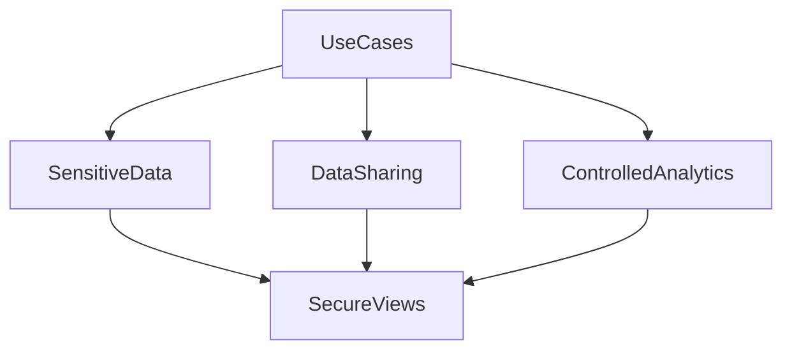

---

# Best Practices

When implementing Secure Views:

Expose only required columns.

Use Secure Views instead of granting direct access to tables.

Combine Secure Views with row-level and column-level security.

Use Secure Views for all external data sharing.

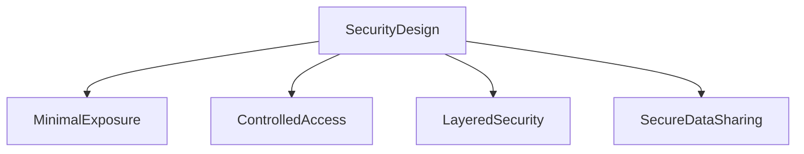

---

# Summary

Secure Views provide an additional security layer for protecting sensitive datasets and business logic.

Key capabilities include:

* Hiding underlying query logic
* Protecting metadata
* Supporting secure data sharing
* Restricting access to raw tables
* Providing controlled data exposure

Secure Views act as a secure abstraction layer that allows organizations to safely expose curated datasets while protecting underlying data structures.
