## Security and Governance in Snowflake

Security and governance in Snowflake control **who can access data, what actions they can perform, and how sensitive information is protected**. Snowflake provides a centralized security framework that enforces access control, protects sensitive data, and ensures regulatory compliance.

Snowflake security is built on two major pillars:

* **Role Based Access Control (RBAC)**
* **Data Protection**

These components work together to protect data across databases, schemas, tables, and other Snowflake objects.

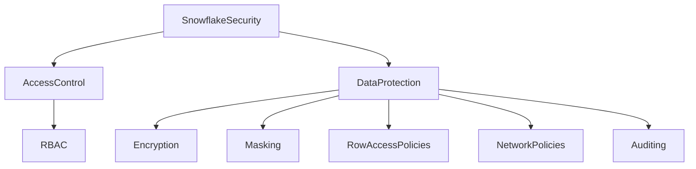

---

# 1. Role Based Access Control (RBAC)

RBAC is the **core access control model in Snowflake**. It determines which users or roles can access specific objects and what operations they are allowed to perform.

Instead of assigning permissions directly to users, Snowflake assigns privileges to **roles**, and roles are granted to users.

This provides centralized permission management and simplifies security administration.

### RBAC Components

Key components involved in Snowflake RBAC:

* Users
* Roles
* Privileges
* Objects
* Role hierarchy

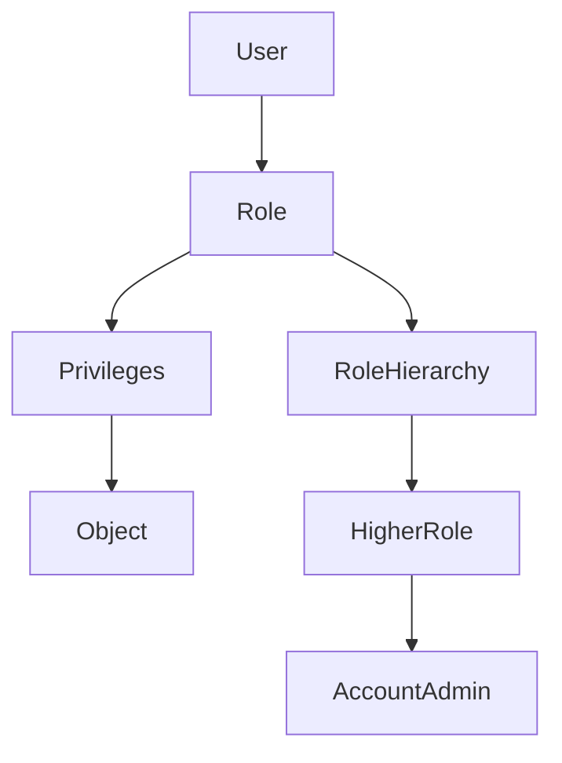

### Important Snowflake System Roles

Snowflake provides built-in administrative roles.

* ACCOUNTADMIN
* SECURITYADMIN
* SYSADMIN
* USERADMIN
* PUBLIC

These roles manage different aspects of the platform such as users, security policies, and infrastructure objects.

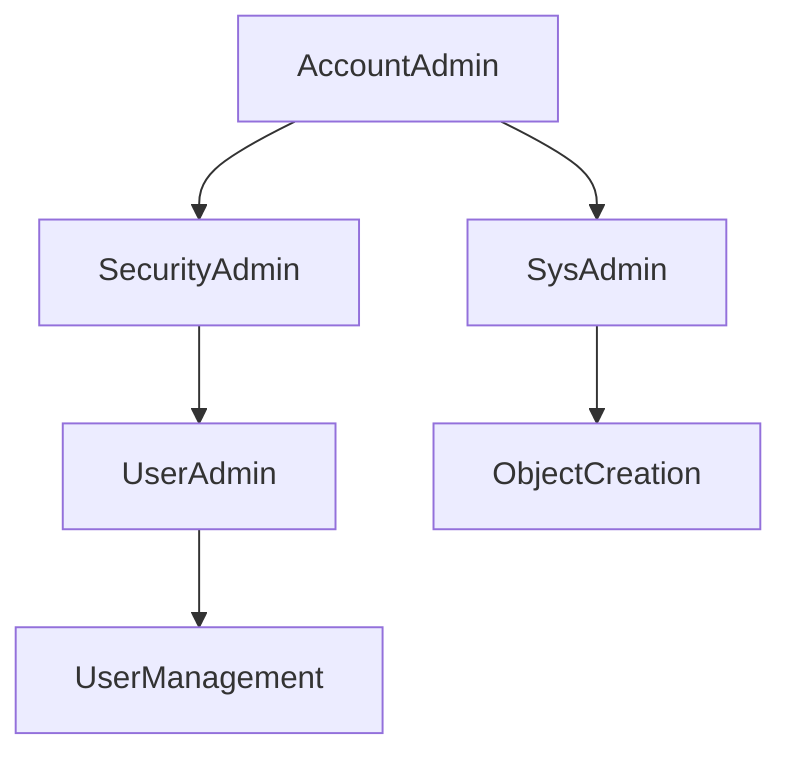

### Privilege Types

Privileges define the actions allowed on objects.

Examples:

* SELECT
* INSERT
* UPDATE
* DELETE
* CREATE
* USAGE
* OWNERSHIP

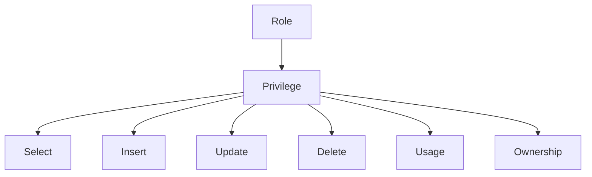

---

# 2. Data Protection

Data protection ensures that sensitive information is protected both **at rest and during access**.

Snowflake provides built-in security features that help organizations comply with regulations such as GDPR, HIPAA, and PCI-DSS.

Key data protection mechanisms include:

* Encryption
* Dynamic Data Masking
* Row Access Policies
* Network Policies
* Secure Views
* Auditing and Access History

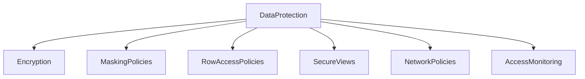

---

## Encryption

Snowflake automatically encrypts all data using strong encryption standards.

Encryption protects:

* Data at rest
* Data in transit
* Metadata

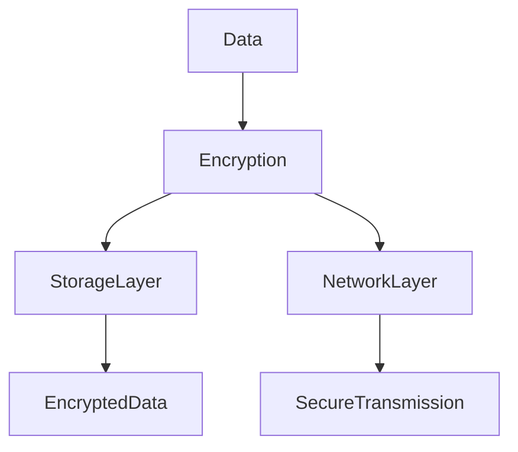

---

## Dynamic Data Masking

Dynamic masking hides sensitive data such as personally identifiable information.

The data is masked depending on the **role accessing the data**.

Example sensitive fields:

* Credit cards
* Emails
* Phone numbers
* Social security numbers

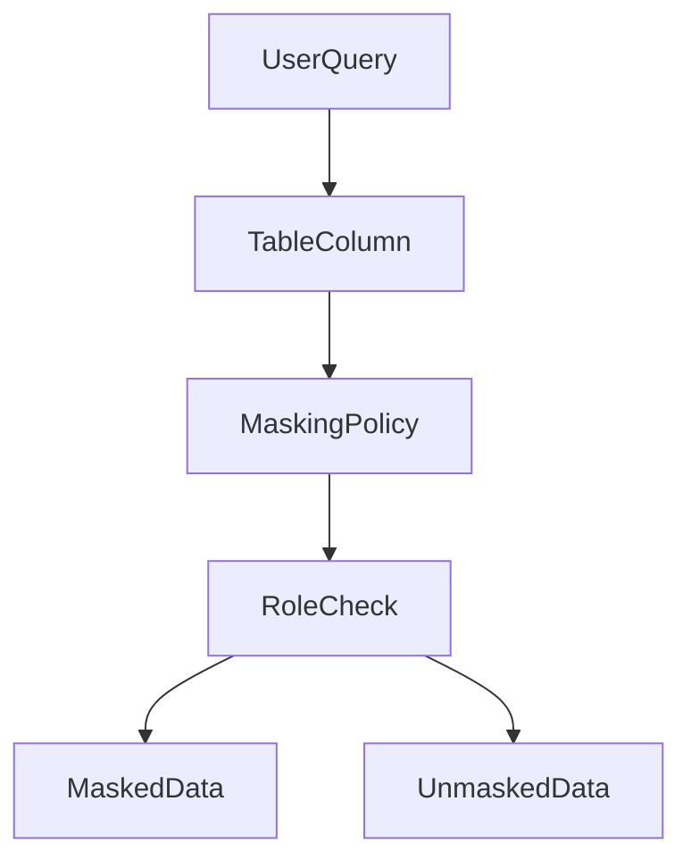

---

## Row Access Policies

Row access policies restrict access to rows based on conditions such as user role, department, or region.

This enables **fine-grained access control**.

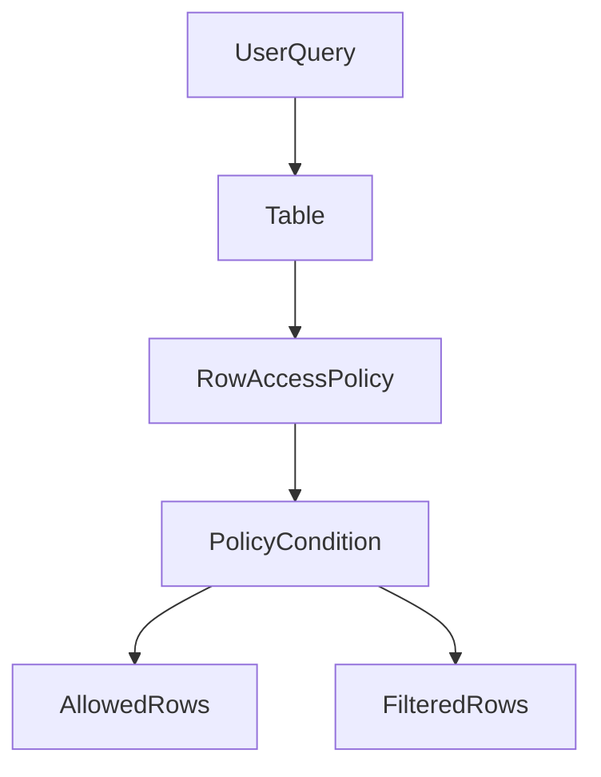

---

## Secure Views

Secure views prevent users from seeing the underlying query logic or sensitive columns.

They are often used to expose controlled datasets to external users.

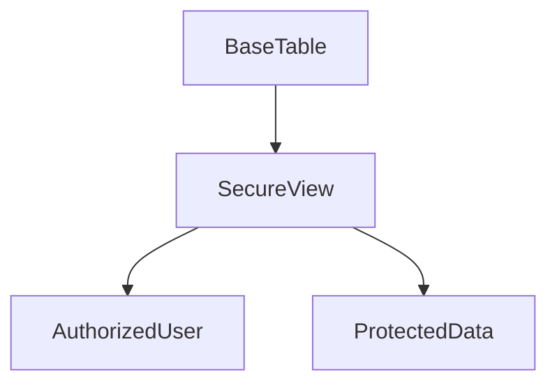

---

## Network Policies

Network policies restrict access to Snowflake based on **IP address ranges**.

This prevents unauthorized access from outside trusted networks.

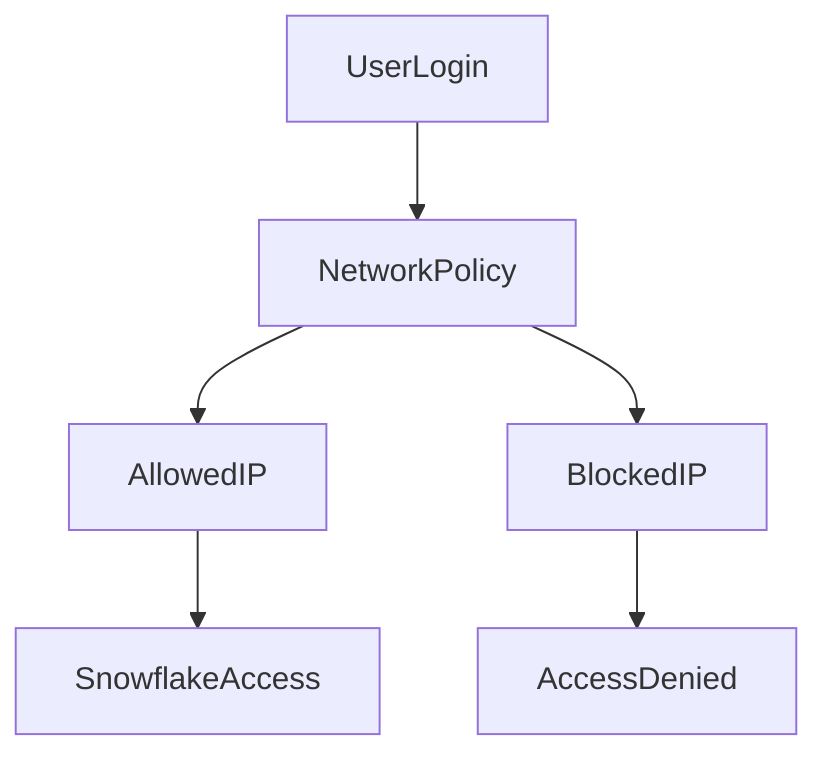

---

## Auditing and Monitoring

Snowflake records detailed access logs and query history to support auditing and compliance.

Administrators can monitor:

* Query history
* Login activity
* Data access patterns

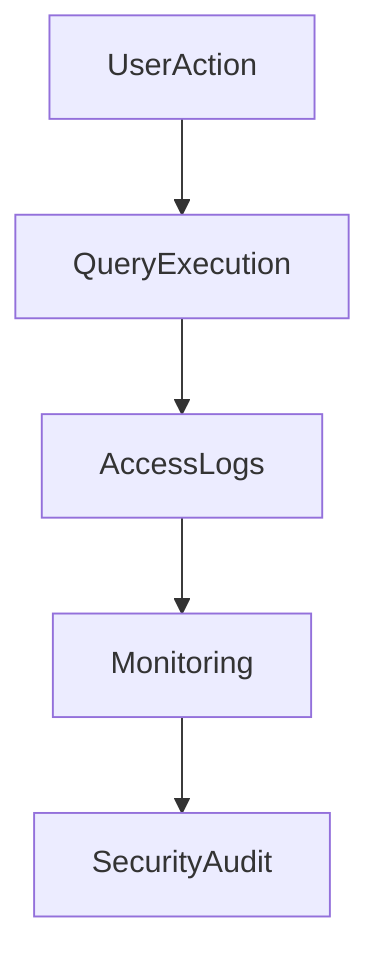

---

# Summary

Snowflake security and governance focus on two main areas:

### Access Control

* Role Based Access Control
* Privilege management
* Role hierarchy

### Data Protection

* Encryption
* Dynamic Data Masking
* Row Access Policies
* Secure Views
* Network Policies
* Auditing and monitoring

Together these components create a **comprehensive security architecture** that protects data while allowing controlled access across the organization.
